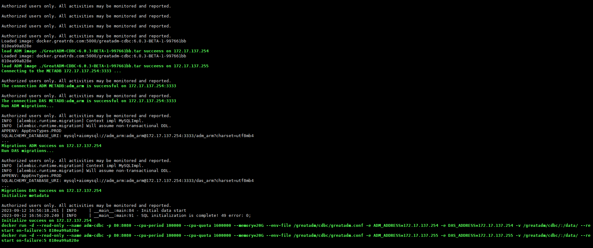
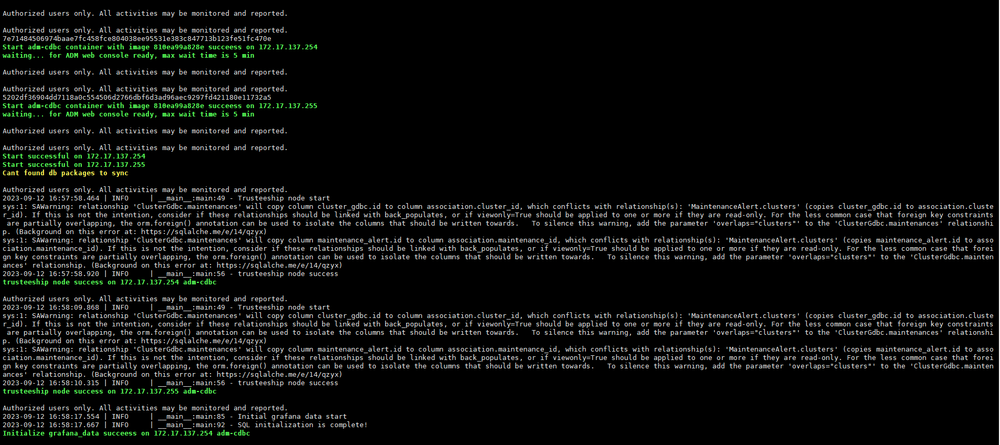
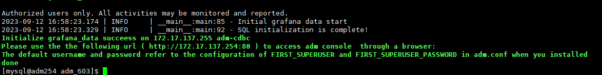

# 安装

```bash


# 1、没有检查netstat命令是否可用，没有则安装：sudo yum -y install net-tools 


# 2、sshpass拷贝不成功


# 3、连接数据库超时


# 4、部署数据库时，要先选择对应的安装包，再选机器，否则可能你选不到机器

# 删除adm
sudo docker stop  adm-cdbc
sudo docker rm -f adm-cdbc
sudo docker rmi -f 810ea99a828e
# 删除数据目录
sudo rm -f /greatadm
# 删除adm和das元数据库
drop database adm;
drop database das;
create database adm;
create database das;


docker exec -it adm-cdbc /bin/bash

```


```shell
Traceback (most recent call last):
  File "/usr/local/lib/python3.9/site-packages/pymysql/connections.py", line 613, in connect
    sock = socket.create_connection(
  File "/usr/local/lib/python3.9/socket.py", line 844, in create_connection
    raise err
  File "/usr/local/lib/python3.9/socket.py", line 832, in create_connection
    sock.connect(sa)
socket.timeout: timed out

During handling of the above exception, another exception occurred:

Traceback (most recent call last):
  File "/usr/local/lib/python3.9/site-packages/sqlalchemy/engine/base.py", line 3250, in _wrap_pool_connect
    return fn()
  File "/usr/local/lib/python3.9/site-packages/sqlalchemy/pool/base.py", line 310, in connect
    return _ConnectionFairy._checkout(self)
  File "/usr/local/lib/python3.9/site-packages/sqlalchemy/pool/base.py", line 868, in _checkout
    fairy = _ConnectionRecord.checkout(pool)
  File "/usr/local/lib/python3.9/site-packages/sqlalchemy/pool/base.py", line 476, in checkout
    rec = pool._do_get()
  File "/usr/local/lib/python3.9/site-packages/sqlalchemy/pool/impl.py", line 146, in _do_get
    self._dec_overflow()
  File "/usr/local/lib/python3.9/site-packages/sqlalchemy/util/langhelpers.py", line 70, in __exit__
    compat.raise_(
  File "/usr/local/lib/python3.9/site-packages/sqlalchemy/util/compat.py", line 207, in raise_
    raise exception
  File "/usr/local/lib/python3.9/site-packages/sqlalchemy/pool/impl.py", line 143, in _do_get
    return self._create_connection()
  File "/usr/local/lib/python3.9/site-packages/sqlalchemy/pool/base.py", line 256, in _create_connection
    return _ConnectionRecord(self)
  File "/usr/local/lib/python3.9/site-packages/sqlalchemy/pool/base.py", line 371, in __init__
    self.__connect()
  File "/usr/local/lib/python3.9/site-packages/sqlalchemy/pool/base.py", line 666, in __connect
    pool.logger.debug("Error on connect(): %s", e)
  File "/usr/local/lib/python3.9/site-packages/sqlalchemy/util/langhelpers.py", line 70, in __exit__
    compat.raise_(
  File "/usr/local/lib/python3.9/site-packages/sqlalchemy/util/compat.py", line 207, in raise_
    raise exception
  File "/usr/local/lib/python3.9/site-packages/sqlalchemy/pool/base.py", line 661, in __connect
    self.dbapi_connection = connection = pool._invoke_creator(self)
  File "/usr/local/lib/python3.9/site-packages/sqlalchemy/engine/create.py", line 590, in connect
    return dialect.connect(*cargs, **cparams)
  File "/usr/local/lib/python3.9/site-packages/sqlalchemy/engine/default.py", line 597, in connect
    return self.dbapi.connect(*cargs, **cparams)
  File "/usr/local/lib/python3.9/site-packages/pymysql/connections.py", line 353, in __init__
    self.connect()
  File "/usr/local/lib/python3.9/site-packages/pymysql/connections.py", line 664, in connect
    raise exc
pymysql.err.OperationalError: (2003, "Can't connect to MySQL server on '172.17.130.48' (timed out)")

The above exception was the direct cause of the following exception:

Traceback (most recent call last):
  File "/app/app/initialize/backend_pre_start.py", line 60, in <module>
    asyncio.run(main())
  File "/usr/local/lib/python3.9/asyncio/runners.py", line 44, in run
    return loop.run_until_complete(main)
  File "/usr/local/lib/python3.9/asyncio/base_events.py", line 647, in run_until_complete
    return future.result()
  File "/app/app/initialize/backend_pre_start.py", line 53, in main
    create_database()
  File "/app/app/initialize/backend_pre_start.py", line 31, in create_database
    with engine.connect() as conn:
  File "/usr/local/lib/python3.9/site-packages/sqlalchemy/engine/base.py", line 3204, in connect
    return self._connection_cls(self, close_with_result=close_with_result)
  File "/usr/local/lib/python3.9/site-packages/sqlalchemy/engine/base.py", line 96, in __init__
    else engine.raw_connection()
  File "/usr/local/lib/python3.9/site-packages/sqlalchemy/engine/base.py", line 3283, in raw_connection
    return self._wrap_pool_connect(self.pool.connect, _connection)
  File "/usr/local/lib/python3.9/site-packages/sqlalchemy/engine/base.py", line 3253, in _wrap_pool_connect
    Connection._handle_dbapi_exception_noconnection(
  File "/usr/local/lib/python3.9/site-packages/sqlalchemy/engine/base.py", line 2100, in _handle_dbapi_exception_noconnection
    util.raise_(
  File "/usr/local/lib/python3.9/site-packages/sqlalchemy/util/compat.py", line 207, in raise_
    raise exception
  File "/usr/local/lib/python3.9/site-packages/sqlalchemy/engine/base.py", line 3250, in _wrap_pool_connect
    return fn()
  File "/usr/local/lib/python3.9/site-packages/sqlalchemy/pool/base.py", line 310, in connect
    return _ConnectionFairy._checkout(self)
  File "/usr/local/lib/python3.9/site-packages/sqlalchemy/pool/base.py", line 868, in _checkout
    fairy = _ConnectionRecord.checkout(pool)
  File "/usr/local/lib/python3.9/site-packages/sqlalchemy/pool/base.py", line 476, in checkout
    rec = pool._do_get()
  File "/usr/local/lib/python3.9/site-packages/sqlalchemy/pool/impl.py", line 146, in _do_get
    self._dec_overflow()
  File "/usr/local/lib/python3.9/site-packages/sqlalchemy/util/langhelpers.py", line 70, in __exit__
    compat.raise_(
  File "/usr/local/lib/python3.9/site-packages/sqlalchemy/util/compat.py", line 207, in raise_
    raise exception
  File "/usr/local/lib/python3.9/site-packages/sqlalchemy/pool/impl.py", line 143, in _do_get
    return self._create_connection()
  File "/usr/local/lib/python3.9/site-packages/sqlalchemy/pool/base.py", line 256, in _create_connection
    return _ConnectionRecord(self)
  File "/usr/local/lib/python3.9/site-packages/sqlalchemy/pool/base.py", line 371, in __init__
    self.__connect()
  File "/usr/local/lib/python3.9/site-packages/sqlalchemy/pool/base.py", line 666, in __connect
    pool.logger.debug("Error on connect(): %s", e)
  File "/usr/local/lib/python3.9/site-packages/sqlalchemy/util/langhelpers.py", line 70, in __exit__
    compat.raise_(
  File "/usr/local/lib/python3.9/site-packages/sqlalchemy/util/compat.py", line 207, in raise_
    raise exception
  File "/usr/local/lib/python3.9/site-packages/sqlalchemy/pool/base.py", line 661, in __connect
    self.dbapi_connection = connection = pool._invoke_creator(self)
  File "/usr/local/lib/python3.9/site-packages/sqlalchemy/engine/create.py", line 590, in connect
    return dialect.connect(*cargs, **cparams)
  File "/usr/local/lib/python3.9/site-packages/sqlalchemy/engine/default.py", line 597, in connect
    return self.dbapi.connect(*cargs, **cparams)
  File "/usr/local/lib/python3.9/site-packages/pymysql/connections.py", line 353, in __init__
    self.connect()
  File "/usr/local/lib/python3.9/site-packages/pymysql/connections.py", line 664, in connect
    raise exc
sqlalchemy.exc.OperationalError: (pymysql.err.OperationalError) (2003, "Can't connect to MySQL server on '172.17.130.48' (timed out)")
(Background on this error at: https://sqlalche.me/e/14/e3q8)
docker rm -f init-adm-data &> /dev/null; docker run --rm --name init-adm-data --env-file /greatadm/cdbc/greatadm.conf -e ADM_ADDRESS=172.17.137.254 -v /greatadm/cdbc/:/data/ 810ea99a828e python /app/app/initialize/backend_pre_start.py
The connection ADM METADB:adm_arm is failed on 172.17.130.48:3333


bin/mysql -uroot -p'y/9qm;o:fQwf' -S /db/storage/guolicheng/mysql_3333/tmp/mysql.sock  -P3333

ALTER USER user() identified by 'root';


/db/storage/guolicheng/mysql_3333/bin/mysqld --defaults-file=/db/storage/guolicheng/mysql_3333/conf/my.cnf
```


![image-20230912165856501](adm.assets/image-20230912165856501.png










# 使用


# 1、软件包管理

```shell
# 软件包名称如下：（注意，不是MySQLPackage-8.0.26-Linux-glibc2.12-arrch64.tar.xz）

MySQLPackage-8.0.26-Linux-glibc2.12-aarch64.tar.xz  
MySQLPackage-8.0.26-Linux-glibc2.12-x86_64.tar.xz
MySQLPackage-8.0.26-Linux-glibc2.28-x86_64.tar.xz
MySQLPackage-8.0.26-Linux-glibc2.28-aarch64.tar.xz

  MySQLPackage-x.x.x-GA-x-xxxxxxxx-Linux-glibc2.17-x86_64.tar.xz，GA可换成RC、BETA等
GreatDBPackage-x.x.x-GA-x-xxxxxxxx-Linux-glibc2.17-x86_64.tar.xz，GA可换成RC、BETA等
# 软件包位置
/greatadm/cdbc/data/download
# 查看glibc版本，软件包版本一定要核对清楚，否则xtrabackup不能正常工作
# ldd --version 
rm -rf /usr/lib64/libgcrypt.so.11
#
tar -xvf archive.tar.xz -C /home/linuxize/files


```


# 资源管理


```


删除并清理的主机:
  172.17.138.2
  172.17.138.1
  172.17.138.0
1. 停止dbinit代理服务。 停止监控、日志采集Agent
systemctl stop adm-dbinit.service
systemctl stop promtail.service
2. 清理logrotate配置
rm -rf /etc/logrotate.d/greatadm
3. 删除启动文件
rm -f /usr/lib/systemd/system/promtail.service
rm -f /usr/lib/systemd/system/adm-dbinit.service
4. 移除创建用户的rootwrap命令sudo免密权限
编辑 “/etc/sudoers” 文件，删除rootwrap命令免密配置


```


# 备份管理


```bash


# 远程备份服务器
# 备份路径：/backup_router


/bin/sh -c /data/svr/MySQLPackage-8.0.26-Linux-glibc2.28-aarch64/tools/percona-xtrabackup/bin/xtrabackup  --defaults-file=/data/dbdata/3308/my3308.cnf --login-path=xtrlogin  --user=admin --password='123456'  --host=172.17.138.2 --port=3308 --backup  --compress  --extra-lsndir=/data/dbdata/3308/tmp/lsn --tmpdir=/data/dbdata/3308/tmp  --stream=xbstream 2> /data/dbdata/3308/tmp/172.17.138.2_3308_full.log | gzip  > /storage/tmp/backup_router/apple/3308/172.17.138.2-3308-20230918163125_full.xbstream.gz  


mysql     699351  7.4  5.9 991232 460032 ?       Sl   16:31   0:22 /data/svr/MySQLPackage-8.0.26-Linux-glibc2.28-aarch64/tools/percona-xtrabackup/bin/xtrabackup --defaults-file=/data/dbdata/3308/my3308.cnf --login-path=xtrlogin --user=admin --password=x xxxxxx --host=172.17.138.2 --port=3308 --backup --compress --extra-lsndir=/data/dbdata/3308/tmp/lsn --tmpdir=/data/dbdata/3308/tmp --stream=xbstream


root@7e7148450697:/app# cat /app/app/playbooks/cluster/project/roles/distribute_and_install_package/tasks/init.yml
---

- name: create svr directory.
  file:
    path: "{{ svr_dir }}"
    state: directory

- name: Download tar file
  get_url:
    url: "{{ package_url }}"
    dest: "{{ svr_dir }}/{{ package_name }}"
    checksum: "md5:{{ package_md5 }}"

- name: create package directory.
  file:
    path: "{{ package_dir }}"
    state: directory

- name: unarchive the compressed binary executable file.
  unarchive:
    dest: "{{ package_dir }}"
    src: "{{ svr_dir }}/{{ package_name }}"
    remote_src: yes
    creates: "{{ package_dir }}/ok"

- name: create unarchive ok file.
  file:
    path: "{{ package_dir }}/ok"
    state: touch


```


# adm数据库解读


## 角色表：auth_role

```mysql

mysql> desc auth_role;
+----------------+--------------+------+-----+---------+----------------+
| Field          | Type         | Null | Key | Default | Extra          |
+----------------+--------------+------+-----+---------+----------------+
| created_at     | datetime     | YES  |     | NULL    |                |
| updated_at     | datetime     | YES  |     | NULL    |                |
| id             | int          | NO   | PRI | NULL    | auto_increment |
| name           | varchar(255) | NO   | UNI | NULL    |                |
| type           | varchar(16)  | NO   |     | NULL    |                |
| domain_id      | int          | YES  |     | NULL    |                |
| description    | varchar(255) | YES  |     | NULL    |                |
| functions_ids  | json         | YES  |     | NULL    |                |
| blacklist_host | json         | YES  |     | NULL    |                |
+----------------+--------------+------+-----+---------+----------------+
9 rows in set (0.01 sec)

mysql> show create table auth_role\G
*************************** 1. row ***************************
       Table: auth_role
Create Table: CREATE TABLE `auth_role` (
  `created_at` datetime DEFAULT NULL,
  `updated_at` datetime DEFAULT NULL,
  `id` int NOT NULL AUTO_INCREMENT,
  `name` varchar(255) NOT NULL,
  `type` varchar(16) NOT NULL,
  `domain_id` int DEFAULT NULL,
  `description` varchar(255) DEFAULT NULL,
  `functions_ids` json DEFAULT NULL,
  `blacklist_host` json DEFAULT NULL,
  PRIMARY KEY (`id`),
  UNIQUE KEY `name` (`name`),
  KEY `ix_auth_role_id` (`id`)
) ENGINE=InnoDB AUTO_INCREMENT=7 DEFAULT CHARSET=utf8mb3
1 row in set (0.10 sec)


mysql> select * from auth_role\G
*************************** 1. row ***************************
    created_at: 2023-09-12 08:32:49
    updated_at: 2023-09-12 08:32:49
            id: 1
          name: ADMIN
          type: ADMIN
     domain_id: NULL
   description: 角色默认包含全部管理权限
 functions_ids: []
blacklist_host: NULL
*************************** 2. row ***************************
    created_at: 2023-09-12 08:32:49
    updated_at: 2023-09-12 08:32:49
            id: 2
          name: PROJECT_ADMIN
          type: MEMBER
     domain_id: NULL
   description: 角色默认包含所有控制台功能
 functions_ids: []
blacklist_host: NULL
*************************** 3. row ***************************
    created_at: 2023-09-12 08:32:49
    updated_at: 2023-09-12 08:32:49
            id: 3
          name: PROJECT_MEMBER
          type: MEMBER
     domain_id: NULL
   description: 角色包含所有控制台只读功能
 functions_ids: []
blacklist_host: NULL
*************************** 4. row ***************************
    created_at: 2023-09-13 01:37:47
    updated_at: 2023-09-13 01:37:47
            id: 4
          name: projectadmin
          type: MEMBER
     domain_id: NULL
   description: 
 functions_ids: ["2.0.1", "2.0.1.1", "2.0.1.2", "2.0.1.3", "2.0.1.4", "2.0.11", "2.0.11.1", "2.0.11.1.1", "2.0.11.1.1.1", "2.0.11.1.1.2", "2.0.11.1.2", "2.0.11.1.2.1", "2.0.11.1.2.2", "2.0.11.1.3", "2.0.11.1.3.1", "2.0.11.1.3.2", "2.0.11.1.4", "2.0.11.1.4.1", "2.0.11.1.4.2", "2.0.11.2", "2.0.11.2.1", "2.0.11.2.1.1", "2.0.11.2.1.2", "2.0.11.2.2", "2.0.11.2.2.1", "2.0.11.2.2.2", "2.0.11.2.3", "2.0.11.2.3.1", "2.0.11.2.3.2", "2.0.11.2.4", "2.0.11.2.4.1", "2.0.11.2.4.2", "2.0.11.3", "2.0.11.3.1", "2.0.11.3.2", "2.0.11.4", "2.0.11.4.1", "2.0.11.4.2", "2.0.2.1", "2.0.2.1.1", "2.0.2.1.1.1", "2.0.2.1.1.2", "2.0.2.1.2", "2.0.2.1.2.1", "2.0.2.1.2.1.1", "2.0.2.1.2.1.1.1", "2.0.2.1.2.1.1.2", "2.0.2.1.2.1.2", "2.0.2.1.2.1.2.1", "2.0.2.1.2.1.2.2", "2.0.2.1.2.1.3", "2.0.2.1.2.1.3.1", "2.0.2.1.2.1.3.2", "2.0.2.1.2.1.4", "2.0.2.1.2.1.4.1", "2.0.2.1.2.1.4.2", "2.0.2.1.2.1.5", "2.0.2.1.2.1.5.1", "2.0.2.1.2.1.5.2", "2.0.2.1.2.2", "2.0.2.1.2.2.1", "2.0.2.1.2.2.2", "2.0.2.1.2.2.2.1", "2.0.2.1.2.2.2.1.1", "2.0.2.1.2.2.2.1.2", "2.0.2.1.2.2.2.2", "2.0.2.1.2.2.2.3", "2.0.2.1.2.2.3", "2.0.2.1.2.2.3.1", "2.0.2.1.2.2.3.2", "2.0.2.1.2.2.4", "2.0.2.1.2.2.5", "2.0.2.1.2.2.5.1", "2.0.2.1.2.2.5.2", "2.0.2.1.2.2.5.3", "2.0.2.1.2.2.5.3.1", "2.0.2.1.2.2.5.3.2", "2.0.2.1.2.2.6", "2.0.2.1.2.2.6.1", "2.0.2.1.2.2.6.2", "2.0.2.1.2.2.7", "2.0.2.1.2.2.7.1", "2.0.2.1.2.2.7.2", "2.0.2.1.2.3", "2.0.2.1.2.3.1", "2.0.2.1.2.3.1.1", "2.0.2.1.2.3.1.2", "2.0.2.1.2.3.2", "2.0.2.1.2.3.2.1", "2.0.2.1.2.3.2.2", "2.0.2.1.2.4", "2.0.2.1.2.4.1", "2.0.2.1.2.4.1.1", "2.0.2.1.2.4.1.2", "2.0.2.1.2.4.2", "2.0.2.1.2.4.2.1", "2.0.2.1.2.4.2.2", "2.0.2.1.2.5", "2.0.2.1.2.5.1", "2.0.2.1.2.5.1.1", "2.0.2.1.2.5.1.2", "2.0.2.1.2.5.2", "2.0.2.1.2.5.2.1", "2.0.2.1.2.5.2.2", "2.0.2.1.2.5.3", "2.0.2.1.2.5.3.1", "2.0.2.1.2.5.3.2", "2.0.2.1.2.5.4", "2.0.2.1.2.5.4.1", "2.0.2.1.2.5.4.2", "2.0.2.1.2.6", "2.0.2.1.2.6.1", "2.0.2.1.2.6.1.1", "2.0.2.1.2.6.2", "2.0.2.1.2.6.2.1", "2.0.2.1.2.6.3", "2.0.2.1.2.6.3.1", "2.0.2.1.2.6.3.2", "2.0.2.1.2.6.4", "2.0.2.1.2.6.4.1", "2.0.2.1.2.6.4.2", "2.0.2.1.2.6.5", "2.0.2.1.2.6.5.1", "2.0.2.1.2.6.6", "2.0.2.1.2.6.6.1", "2.0.2.1.2.7", "2.0.2.1.2.7.1", "2.0.2.1.2.7.1.1", "2.0.2.1.2.7.1.2", "2.0.2.1.2.7.2", "2.0.2.1.2.7.2.1", "2.0.2.1.2.7.2.2", "2.0.2.1.2.8", "2.0.2.1.2.8.1", "2.0.2.1.2.8.1.1", "2.0.2.1.2.8.1.2", "2.0.4", "2.0.4.1", "2.0.4.1.1", "2.0.4.1.2", "2.0.4.2", "2.0.4.2.1", "2.0.4.2.2", "2.0.4.3", "2.0.4.3.1", "2.0.4.3.2", "2.0.4.4", "2.0.4.4.1", "2.0.4.4.2", "2.0.4.5", "2.0.4.5.1", "2.0.4.5.2", "2.0.4.6", "2.0.4.6.1", "2.0.4.6.2", "2.0.7", "2.0.7.1", "2.0.7.1.1", "2.0.7.1.2", "2.0.7.2", "2.0.7.2.1", "2.0.7.2.2", "2.0.7.3", "2.0.7.3.1", "2.0.7.3.2", "2.0.7.4", "2.0.7.4.1", "2.0.7.4.2", "2.0.8", "2.0.8.1", "2.0.8.2", "2.0.8.2.1", "2.0.8.2.2", "2.0.8.3", "2.0.8.3.1", "2.0.8.3.1.1", "2.0.8.3.1.1.1", "2.0.8.3.1.1.2", "2.0.8.3.1.2", "2.0.8.3.1.2.1", "2.0.8.3.1.2.2", "2.0.8.3.1.3", "2.0.8.3.1.3.1", "2.0.8.3.1.3.2", "2.0.8.3.1.4", "2.0.8.3.1.4.1", "2.0.8.3.1.4.2", "2.0.8.3.1.5", "2.0.8.3.1.5.1", "2.0.8.3.1.5.2", "2.0.8.3.1.6", "2.0.8.3.1.6.1", "2.0.8.3.1.6.2", "2.0.8.3.2", "2.0.8.4", "2.0.8.4.1", "2.0.8.4.1.1", "2.0.8.4.1.1.1", "2.0.8.4.1.1.2", "2.0.8.4.1.2", "2.0.8.4.1.2.1", "2.0.8.4.1.2.2", "2.0.8.4.1.3", "2.0.8.4.1.3.1", "2.0.8.4.1.3.2", "2.0.8.4.1.4", "2.0.8.4.1.4.1", "2.0.8.4.1.4.2", "2.0.8.4.1.5", "2.0.8.4.1.5.1", "2.0.8.4.1.5.2", "2.0.8.4.1.6", "2.0.8.4.1.6.1", "2.0.8.4.1.6.2", "2.0.8.4.2", "2.0.8.5", "2.0.8.5.1", "2.0.8.5.1.1", "2.0.8.5.1.1.1", "2.0.8.5.1.1.2", "2.0.8.5.1.2", "2.0.8.5.1.2.1", "2.0.8.5.1.2.2", "2.0.8.5.1.3", "2.0.8.5.1.3.1", "2.0.8.5.1.3.2", "2.0.8.5.1.4", "2.0.8.5.1.4.1", "2.0.8.5.1.4.2", "2.0.8.5.1.5", "2.0.8.5.1.5.1", "2.0.8.5.1.5.2", "2.0.8.5.1.6", "2.0.8.5.1.6.1", "2.0.8.5.1.6.2", "2.0.8.5.2", "2.0.8.6", "2.0.8.6.1", "2.0.8.6.1.1", "2.0.8.6.1.1.1", "2.0.8.6.1.1.2", "2.0.8.6.1.2", "2.0.8.6.1.2.1", "2.0.8.6.1.2.2", "2.0.8.6.1.3", "2.0.8.6.1.3.1", "2.0.8.6.1.3.2", "2.0.8.6.1.4", "2.0.8.6.1.4.1", "2.0.8.6.1.4.2", "2.0.8.6.1.5", "2.0.8.6.1.5.1", "2.0.8.6.1.5.2", "2.0.8.6.1.6", "2.0.8.6.1.6.1", "2.0.8.6.1.6.2", "2.0.8.6.2", "2", "2.0.2", "2.0"]
blacklist_host: NULL


```


## 用户表：auth_user

1.  用户过期时间为expires_at_int，过期了后，需要更改此字段；
2.  用户名必须唯一；
3.  邮箱必须唯一；

```mysql

mysql> desc auth_user;
+-------------------+--------------+------+-----+---------+----------------+
| Field             | Type         | Null | Key | Default | Extra          |
+-------------------+--------------+------+-----+---------+----------------+
| created_at        | datetime     | YES  |     | NULL    |                |
| updated_at        | datetime     | YES  |     | NULL    |                |
| id                | int          | NO   | PRI | NULL    | auto_increment |
| full_name         | varchar(36)  | YES  | UNI | NULL    |                |
| email             | varchar(64)  | NO   | UNI | NULL    |                |
| hashed_password   | varchar(255) | NO   |     | NULL    |                |
| is_active         | tinyint(1)   | YES  |     | NULL    |                |
| is_superuser      | tinyint(1)   | YES  |     | NULL    |                |
| domain_id         | varchar(64)  | YES  |     | NULL    |                |
| enabled           | tinyint(1)   | YES  |     | NULL    |                |
| last_active_at    | datetime     | YES  |     | NULL    |                |
| failed_auth_count | int          | YES  |     | NULL    |                |
| failed_auth_at    | datetime     | YES  |     | NULL    |                |
| expires_at_int    | datetime     | YES  |     | NULL    |                |
+-------------------+--------------+------+-----+---------+----------------+
14 rows in set (0.67 sec)

mysql> show create table auth_user\G
*************************** 1. row ***************************
       Table: auth_user
Create Table: CREATE TABLE `auth_user` (
  `created_at` datetime DEFAULT NULL,
  `updated_at` datetime DEFAULT NULL,
  `id` int NOT NULL AUTO_INCREMENT,
  `full_name` varchar(36) DEFAULT NULL,
  `email` varchar(64) NOT NULL,
  `hashed_password` varchar(255) NOT NULL,
  `is_active` tinyint(1) DEFAULT NULL,
  `is_superuser` tinyint(1) DEFAULT NULL,
  `domain_id` varchar(64) DEFAULT NULL,
  `enabled` tinyint(1) DEFAULT NULL,
  `last_active_at` datetime DEFAULT NULL,
  `failed_auth_count` int DEFAULT NULL,
  `failed_auth_at` datetime DEFAULT NULL,
  `expires_at_int` datetime DEFAULT NULL,
  PRIMARY KEY (`id`),
  UNIQUE KEY `ix_auth_user_email` (`email`),
  UNIQUE KEY `ix_auth_user_full_name` (`full_name`),
  KEY `ix_auth_user_id` (`id`)
) ENGINE=InnoDB AUTO_INCREMENT=8 DEFAULT CHARSET=utf8mb3
1 row in set (0.01 sec)

mysql> select * from auth_user\G
*************************** 1. row ***************************
       created_at: 2023-09-12 08:32:49
       updated_at: 2023-09-14 01:04:44
               id: 1
        full_name: adm
            email: adm@greatdb.com
  hashed_password: $2b$12$Im9p/fmGrEZ0Q/dSNzJeN.GzsFBKaRxh.Bxlqtr1.q1DFTDbdCAGS
        is_active: 1
     is_superuser: 1
        domain_id: NULL
          enabled: 1
   last_active_at: 2023-09-14 01:04:44
failed_auth_count: NULL
   failed_auth_at: NULL
   expires_at_int: 2023-10-11 09:02:27
*************************** 2. row ***************************
       created_at: 2023-09-13 08:48:01
       updated_at: 2023-09-13 08:50:53
               id: 4
        full_name: igoodful
            email: igoodful@qq.com
  hashed_password: $2b$12$xs6fvUZwWXLT9X3OQ5szp.S0WhT24T2FpuCfWVuJEqXTYtY9RWMum
        is_active: 1
     is_superuser: 1
        domain_id: NULL
          enabled: 1
   last_active_at: 2023-09-13 08:50:53
failed_auth_count: NULL
   failed_auth_at: NULL
   expires_at_int: 2023-10-12 08:48:01
*************************** 3. row ***************************
       created_at: 2023-09-13 08:55:40
       updated_at: 2023-09-13 08:56:01
               id: 7
        full_name: igoodfulX
            email: igoodful@gmail.com
  hashed_password: $2b$12$Os2iUOc3sSHyM0lEr40AS.a5zX8sMGmnbHEarts0g4bJtyqZ9gTyO
        is_active: 1
     is_superuser: 1
        domain_id: NULL
          enabled: 1
   last_active_at: 2023-09-13 08:56:01
failed_auth_count: NULL
   failed_auth_at: NULL
   expires_at_int: 2023-10-12 08:55:40
3 rows in set (0.00 sec)

-- 更改用户登录过期时间
mysql> update auth_user set expires_at_int='2099-09-14 09:22:00' where id=1;
```


## 项目表：auth_project

admin项目存在，但不会显示在界面上

```mysql
mysql> desc auth_project;
+-------------+--------------+------+-----+---------+----------------+
| Field       | Type         | Null | Key | Default | Extra          |
+-------------+--------------+------+-----+---------+----------------+
| created_at  | datetime     | YES  |     | NULL    |                |
| updated_at  | datetime     | YES  |     | NULL    |                |
| id          | int          | NO   | PRI | NULL    | auto_increment |
| name        | varchar(255) | NO   | UNI | NULL    |                |
| domain_id   | int          | YES  |     | NULL    |                |
| parent_id   | int          | YES  |     | NULL    |                |
| description | varchar(255) | YES  |     | NULL    |                |
| is_domain   | tinyint(1)   | YES  |     | NULL    |                |
| enabled     | tinyint(1)   | NO   |     | NULL    |                |
| label       | json         | YES  |     | NULL    |                |
| create_by   | varchar(255) | YES  |     | NULL    |                |
+-------------+--------------+------+-----+---------+----------------+
11 rows in set (0.03 sec)

mysql> show create table  auth_project\G
*************************** 1. row ***************************
       Table: auth_project
Create Table: CREATE TABLE `auth_project` (
  `created_at` datetime DEFAULT NULL,
  `updated_at` datetime DEFAULT NULL,
  `id` int NOT NULL AUTO_INCREMENT,
  `name` varchar(255) NOT NULL,
  `domain_id` int DEFAULT NULL,
  `parent_id` int DEFAULT NULL,
  `description` varchar(255) DEFAULT NULL,
  `is_domain` tinyint(1) DEFAULT NULL,
  `enabled` tinyint(1) NOT NULL,
  `label` json DEFAULT NULL,
  `create_by` varchar(255) DEFAULT NULL,
  PRIMARY KEY (`id`),
  UNIQUE KEY `name` (`name`),
  KEY `ix_auth_project_id` (`id`)
) ENGINE=InnoDB AUTO_INCREMENT=6 DEFAULT CHARSET=utf8mb3
1 row in set (0.05 sec)

mysql> select * from auth_project\G
*************************** 1. row ***************************
 created_at: 2023-09-12 08:32:49
 updated_at: 2023-09-12 08:32:49
         id: 1
       name: admin
  domain_id: NULL
  parent_id: NULL
description: NULL
  is_domain: 0
    enabled: 1
      label: NULL
  create_by: NULL
*************************** 2. row ***************************
 created_at: 2023-09-12 08:32:49
 updated_at: 2023-09-12 08:32:49
         id: 2
       name: default
  domain_id: NULL
  parent_id: NULL
description: NULL
  is_domain: 0
    enabled: 1
      label: NULL
  create_by: NULL
*************************** 3. row ***************************
 created_at: 2023-09-13 01:34:57
 updated_at: 2023-09-13 01:34:57
         id: 3
       name: admproject
  domain_id: NULL
  parent_id: NULL
description: 
  is_domain: 0
    enabled: 1
      label: NULL
  create_by: NULL
*************************** 4. row ***************************
 created_at: 2023-09-13 01:35:11
 updated_at: 2023-09-13 01:35:11
         id: 4
       name: igoodfulproject
  domain_id: NULL
  parent_id: NULL
description: 
  is_domain: 0
    enabled: 1
      label: NULL
  create_by: NULL
*************************** 5. row ***************************
 created_at: 2023-09-13 08:44:00
 updated_at: 2023-09-13 08:44:00
         id: 5
       name: igoodful
  domain_id: NULL
  parent_id: NULL
description: 
  is_domain: 0
    enabled: 1
      label: NULL
  create_by: NULL
5 rows in set (0.01 sec)


```


## 权限控制表：auth_function_access_control

树状结构

```mysql
mysql> desc auth_function_access_control;
+----------------+--------------+------+-----+---------+-------+
| Field          | Type         | Null | Key | Default | Extra |
+----------------+--------------+------+-----+---------+-------+
| created_at     | datetime     | YES  |     | NULL    |       |
| updated_at     | datetime     | YES  |     | NULL    |       |
| id             | varchar(255) | NO   | PRI | NULL    |       |
| permission     | varchar(10)  | NO   |     | NULL    |       |
| url            | mediumtext   | YES  |     | NULL    |       |
| parent_id      | varchar(255) | YES  |     | NULL    |       |
| display_name   | varchar(64)  | NO   |     | NULL    |       |
| master_node    | tinyint(1)   | YES  |     | NULL    |       |
| policy_check   | varchar(128) | NO   |     | NULL    |       |
| function_types | varchar(16)  | NO   |     | NULL    |       |
| node_types     | varchar(32)  | YES  |     | NULL    |       |
+----------------+--------------+------+-----+---------+-------+
11 rows in set (0.00 sec)

mysql> show create table auth_function_access_control\G
*************************** 1. row ***************************
       Table: auth_function_access_control
Create Table: CREATE TABLE `auth_function_access_control` (
  `created_at` datetime DEFAULT NULL,
  `updated_at` datetime DEFAULT NULL,
  `id` varchar(255) NOT NULL,
  `permission` varchar(10) NOT NULL,
  `url` mediumtext,
  `parent_id` varchar(255) DEFAULT NULL,
  `display_name` varchar(64) NOT NULL,
  `master_node` tinyint(1) DEFAULT NULL,
  `policy_check` varchar(128) NOT NULL,
  `function_types` varchar(16) NOT NULL,
  `node_types` varchar(32) DEFAULT NULL,
  PRIMARY KEY (`id`)
) ENGINE=InnoDB DEFAULT CHARSET=utf8mb3
1 row in set (0.00 sec)

mysql> select * from   auth_function_access_control limit 5\G
*************************** 1. row ***************************
    created_at: NULL
    updated_at: NULL
            id: 1
    permission: ADMIN
           url: NULL
     parent_id: NULL
  display_name: 管理后台
   master_node: 1
  policy_check: management_background
function_types: read-only
    node_types: NULL
*************************** 2. row ***************************
    created_at: NULL
    updated_at: NULL
            id: 1.0
    permission: ADMIN
           url: NULL
     parent_id: 1
  display_name: 数据库服务
   master_node: 1
  policy_check: great_db
function_types: read-only
    node_types: NULL
*************************** 3. row ***************************
    created_at: NULL
    updated_at: NULL
            id: 1.0.1
    permission: ADMIN
           url: NULL
     parent_id: 1.0
  display_name: 概览
   master_node: 1
  policy_check: overview
function_types: read-only
    node_types: NULL
*************************** 4. row ***************************
    created_at: NULL
    updated_at: NULL
            id: 1.0.1.1
    permission: ADMIN
           url: NULL
     parent_id: 1.0.1
  display_name: GreatDBRouter三节点
   master_node: 0
  policy_check: router_ms
function_types: read-only
    node_types: NULL
*************************** 5. row ***************************
    created_at: NULL
    updated_at: NULL
            id: 1.0.1.2
    permission: ADMIN
           url: NULL
     parent_id: 1.0.1
  display_name: PAXOS高可用复制
   master_node: 0
  policy_check: mgr
function_types: read-only
    node_types: NULL
5 rows in set (0.01 sec)


```


## 授权记录表：auth_assignment

1.  用户id：actor_id
2.  角色id：role_id

```mysql
mysql> desc auth_assignment;
+------------+-------------+------+-----+---------+-------+
| Field      | Type        | Null | Key | Default | Extra |
+------------+-------------+------+-----+---------+-------+
| created_at | datetime    | YES  |     | NULL    |       |
| updated_at | datetime    | YES  |     | NULL    |       |
| type       | varchar(36) | NO   | PRI | NULL    |       |
| actor_id   | int         | NO   | PRI | NULL    |       |
| target_id  | int         | NO   | PRI | NULL    |       |
| role_id    | int         | NO   | PRI | NULL    |       |
| inherited  | tinyint(1)  | NO   | PRI | NULL    |       |
+------------+-------------+------+-----+---------+-------+
7 rows in set (0.04 sec)

mysql> show create table auth_assignment\G
*************************** 1. row ***************************
       Table: auth_assignment
Create Table: CREATE TABLE `auth_assignment` (
  `created_at` datetime DEFAULT NULL,
  `updated_at` datetime DEFAULT NULL,
  `type` varchar(36) NOT NULL,
  `actor_id` int NOT NULL,
  `target_id` int NOT NULL,
  `role_id` int NOT NULL,
  `inherited` tinyint(1) NOT NULL,
  PRIMARY KEY (`type`,`actor_id`,`target_id`,`role_id`,`inherited`),
  KEY `idx_actor_id` (`actor_id`)
) ENGINE=InnoDB DEFAULT CHARSET=utf8mb3
1 row in set (0.02 sec)

mysql> select * from   auth_assignment;
+---------------------+---------------------+--------------+----------+-----------+---------+-----------+
| created_at          | updated_at          | type         | actor_id | target_id | role_id | inherited |
+---------------------+---------------------+--------------+----------+-----------+---------+-----------+
| 2023-09-12 08:32:49 | 2023-09-12 08:32:49 | USER_PROJECT |        1 |         1 |       1 |         0 |
| 2023-09-13 08:48:01 | 2023-09-13 08:48:01 | USER_PROJECT |        4 |         1 |       5 |         0 |
| 2023-09-13 08:55:40 | 2023-09-13 08:55:40 | USER_PROJECT |        7 |         1 |       6 |         0 |
| 2023-09-14 01:47:07 | 2023-09-14 01:47:07 | USER_PROJECT |        8 |         2 |       2 |         0 |
| 2023-09-14 01:47:07 | 2023-09-14 01:47:07 | USER_PROJECT |        8 |         3 |       2 |         0 |
| 2023-09-14 01:47:07 | 2023-09-14 01:47:07 | USER_PROJECT |        8 |         4 |       2 |         0 |
| 2023-09-14 01:47:07 | 2023-09-14 01:47:07 | USER_PROJECT |        8 |         5 |       2 |         0 |
+---------------------+---------------------+--------------+----------+-----------+---------+-----------+
7 rows in set (0.03 sec)

```


## 软件包表：cluster_package

1.  安装包名称必须唯一；
2.  status有SUCCESS、DELETE、ERROR、UPLOADING，其中SUCCESS状态的才可使用
3.  在界面上删除软件包后，会实际删除软件包，但是该软件包记录不会删除，标记为删除状态
4.  手工删除软件包：删除该表对应记录，再删除download目录下的软件包即可

```mysql

mysql> desc cluster_package;
+--------------+----------------------------------------------+------+-----+---------+----------------+
| Field        | Type                                         | Null | Key | Default | Extra          |
+--------------+----------------------------------------------+------+-----+---------+----------------+
| created_at   | datetime                                     | YES  |     | NULL    |                |
| updated_at   | datetime                                     | YES  |     | NULL    |                |
| id           | int                                          | NO   | PRI | NULL    | auto_increment |
| name         | varchar(255)                                 | NO   | UNI | NULL    |                |
| architecture | varchar(10)                                  | NO   |     | NULL    |                |
| address      | varchar(255)                                 | YES  |     | NULL    |                |
| description  | varchar(255)                                 | YES  |     | NULL    |                |
| version      | varchar(255)                                 | YES  |     | NULL    |                |
| md5          | varchar(255)                                 | YES  |     | NULL    |                |
| os           | varchar(64)                                  | YES  |     | NULL    |                |
| file_size    | bigint                                       | YES  |     | NULL    |                |
| type         | varchar(64)                                  | YES  |     | NULL    |                |
| status       | enum('SUCCESS','ERROR','UPLOADING','DELETE') | YES  |     | NULL    |                |
+--------------+----------------------------------------------+------+-----+---------+----------------+
13 rows in set (0.04 sec)

mysql> show create table  cluster_package\G;
*************************** 1. row ***************************
       Table: cluster_package
Create Table: CREATE TABLE `cluster_package` (
  `created_at` datetime DEFAULT NULL,
  `updated_at` datetime DEFAULT NULL,
  `id` int NOT NULL AUTO_INCREMENT,
  `name` varchar(255) NOT NULL,
  `architecture` varchar(10) NOT NULL,
  `address` varchar(255) DEFAULT NULL,
  `description` varchar(255) DEFAULT NULL,
  `version` varchar(255) DEFAULT NULL,
  `md5` varchar(255) DEFAULT NULL,
  `os` varchar(64) DEFAULT NULL,
  `file_size` bigint DEFAULT NULL,
  `type` varchar(64) DEFAULT NULL,
  `status` enum('SUCCESS','ERROR','UPLOADING','DELETE') DEFAULT NULL,
  PRIMARY KEY (`id`),
  UNIQUE KEY `name` (`name`),
  KEY `ix_cluster_package_id` (`id`)
) ENGINE=InnoDB AUTO_INCREMENT=12 DEFAULT CHARSET=utf8mb3
1 row in set (0.00 sec)

ERROR: 
No query specified

mysql> select * from cluster_package\G;
*************************** 1. row ***************************
  created_at: 2023-09-12 14:02:24
  updated_at: 2023-09-14 01:27:13
          id: 1
        name: MySQLPackage-8.0.26-Linux-glibc2.12-x86_64.tar.xz
architecture: x86_64
     address: ["172.17.137.254:80", "172.17.137.255:80"]
 description: NULL
     version: 8.0.26
         md5: 090f9c7d30f6ac04b1aa7e4c376fbd73
          os: Linux
   file_size: 1288819096
        type: GreatDBPackage
      status: SUCCESS
*************************** 2. row ***************************
  created_at: 2023-09-12 14:04:58
  updated_at: 2023-09-14 01:27:25
          id: 2
        name: MySQLPackage-8.0.26-Linux-glibc2.12-aarch64.tar.xz
architecture: aarch64
     address: ["172.17.137.254:80", "172.17.137.255:80"]
 description: NULL
     version: 8.0.26
         md5: fdc5d6a23fee2885e7c137c3a264428d
          os: Linux
   file_size: 1058942800
        type: GreatDBPackage
      status: SUCCESS
*************************** 3. row ***************************
  created_at: 2023-09-13 01:27:21
  updated_at: 2023-09-14 01:59:42
          id: 5
        name: mysql-8.0.26-linux-glibc2.12-x86_64.tar.xz
architecture: x86_64
     address: ["172.17.137.255:80"]
 description: NULL
     version: 8.0.26
         md5: 0ad8528264572bcda177c9e85e789818
          os: linux
   file_size: 0
        type: MySQL
      status: DELETE
*************************** 4. row ***************************
  created_at: 2023-09-13 01:31:20
  updated_at: 2023-09-14 01:57:05
          id: 6
        name: mysql-8.0.26-linux-glibc2.17-aarch64.tar.gz
architecture: aarch64
     address: ["172.17.137.254:80", "172.17.137.255:80"]
 description: NULL
     version: 8.0.26
         md5: 77269a421415ffc885459e2f6490cebf
          os: linux
   file_size: 619549928
        type: MySQL
      status: SUCCESS
*************************** 5. row ***************************
  created_at: 2023-09-13 03:20:44
  updated_at: 2023-09-14 01:57:19
          id: 8
        name: MySQLPackage-8.0.26-Linux-glibc2.28-aarch64.tar.xz
architecture: aarch64
     address: ["172.17.137.254:80", "172.17.137.255:80"]
 description: NULL
     version: 8.0.26
         md5: 9ae3f5210a2bccd44fc4f982b2f3a484
          os: Linux
   file_size: 874506620
        type: GreatDBPackage
      status: SUCCESS
*************************** 6. row ***************************
  created_at: 2023-09-13 03:20:59
  updated_at: 2023-09-14 01:57:29
          id: 9
        name: MySQLPackage-8.0.26-Linux-glibc2.28-x86_64.tar.xz
architecture: x86_64
     address: ["172.17.137.254:80", "172.17.137.255:80"]
 description: NULL
     version: 8.0.26
         md5: 719cca5c977f6535d84d6f53b47bf72b
          os: Linux
   file_size: 774178028
        type: GreatDBPackage
      status: SUCCESS
6 rows in set (0.00 sec)


```


## 集群配置表：cluster_config

1.  role：ROUTER表示dbscale，DATABASE表示数据节点
2.  database 服务器的默认字符集，数据节点的默认character_set_server为utf8，建议修改为utf8mb4
3.  innodb_buffer_pool_size默认为30G，根据实际修改
4.  long_query_time默认值为10s，建议修改为1s
5.  session-init-charset：该参数默认utf8，需要将其改为''，router dbscale集群会话初始的字符集，相当于set names的效果


```mysql
mysql> desc cluster_config;
+---------------+--------------+------+-----+---------+----------------+
| Field         | Type         | Null | Key | Default | Extra          |
+---------------+--------------+------+-----+---------+----------------+
| created_at    | datetime     | YES  |     | NULL    |                |
| updated_at    | datetime     | YES  |     | NULL    |                |
| id            | int          | NO   | PRI | NULL    | auto_increment |
| name          | varchar(64)  | NO   |     | NULL    |                |
| template_file | mediumtext   | YES  |     | NULL    |                |
| description   | varchar(255) | YES  |     | NULL    |                |
| public        | tinyint(1)   | YES  |     | NULL    |                |
| hidden        | tinyint(1)   | YES  |     | NULL    |                |
| project_id    | int          | YES  | MUL | NULL    |                |
| role          | varchar(16)  | YES  |     | NULL    |                |
| gdbc_type     | varchar(64)  | YES  |     | NULL    |                |
+---------------+--------------+------+-----+---------+----------------+
11 rows in set (0.00 sec)

mysql> show create table  cluster_config\G
*************************** 1. row ***************************
       Table: cluster_config
Create Table: CREATE TABLE `cluster_config` (
  `created_at` datetime DEFAULT NULL,
  `updated_at` datetime DEFAULT NULL,
  `id` int NOT NULL AUTO_INCREMENT,
  `name` varchar(64) NOT NULL,
  `template_file` mediumtext,
  `description` varchar(255) DEFAULT NULL,
  `public` tinyint(1) DEFAULT NULL,
  `hidden` tinyint(1) DEFAULT NULL,
  `project_id` int DEFAULT NULL COMMENT '项目ID',
  `role` varchar(16) DEFAULT NULL,
  `gdbc_type` varchar(64) DEFAULT NULL COMMENT '集群类型',
  PRIMARY KEY (`id`),
  UNIQUE KEY `project_id_name` (`project_id`,`name`),
  KEY `ix_cluster_config_id` (`id`)
) ENGINE=InnoDB AUTO_INCREMENT=11 DEFAULT CHARSET=utf8mb3
1 row in set (0.00 sec)

mysql> select * from cluster_config limit 2\G;
*************************** 1. row ***************************
   created_at: 2022-05-16 13:30:34
   updated_at: NULL
           id: 5
         name: Default_GreatDB_Cluster_Router_Configuration
template_file: [main]
zookeeper-host = {{ zookeeper-host }}
zookeeper-password= {{ zookeeper-password}}
admin-user = {{ admin-user }}
admin-password = {{ admin-password }}
cluster-user = {{ cluster-user }}
cluster-password = {{ cluster-password }}
dbscale-hosts = {{ dbscale-host }}
authenticate-source = {{ authentication-source }}
driver = {{ driver }}
log-file = {{ log-file }}
pid-file = {{ pid-file }}
zk-log-file = {{ zk-log-file }}
function-type-file = {{ function-type-file }}
node-host-addr = {{ node-host-add }}
supreme-admin-user = {{ supreme-admin-user }}
multiple-mode = 1

  description: router节点默认配置
       public: 1
       hidden: 0
   project_id: 1
         role: ROUTER
    gdbc_type: router_ms
*************************** 2. row ***************************
   created_at: 2022-05-16 13:30:34
   updated_at: NULL
           id: 6
         name: Default_GreatDB_Cluster_DataBaseNode_Configuration
template_file: [mysqld]
basedir = {{ basedir }}
datadir = {{ datadir }}
port = {{ port }}
log_bin = {{ log_bin }}
relay_log = {{ relay_log }}
socket = {{ socket }}
tmpdir = {{ tmpdir }}
mysqlx_port = {{ mysqlx_port }}
mysqlx_socket = {{ mysqlx_socket }}
user = {{ user }}
report_host = {{ report_host }}
server_id = {{ server_id }}
loose-group_replication_local_address = {{ loose-group_replication_local_address }}
general-log-file = {{ general-log-file }}
slow-query-log-file = {{ slow-query-log-file }}
log-error = {{ log-error }}
pid-file = {{ pid-file }}
max_connections = {{ max_connections }}
enforce_gtid_consistency = {{ enforce_gtid_consistency }}
loose-group_replication_start_on_boot = {{ loose-group_replication_start_on_boot }}
local_infile = {{ local_infile }}
character_set_server = {{ character_set_server }}
collation_server = {{ collation_server }}
init_connect = {{ init_connect }}
lower_case_table_names = {{ lower_case_table_names }}
skip_name_resolve = {{ skip_name_resolve }}
default_time_zone = {{ default_time_zone }}
default_authentication_plugin = {{ default_authentication_plugin }}
loose-group_replication_consistency = {{ loose-group_replication_consistency }}
loose-group_replication_recovery_get_public_key = {{ loose-group_replication_recovery_get_public_key }}
loose-greatdb_result_cache_size = {{ loose-greatdb_result_cache_size }}
lock_wait_timeout = {{ lock_wait_timeout }}
open_files_limit = {{ open_files_limit }}
back_log = {{ back_log }}
max_connect_errors = {{ max_connect_errors }}
table_open_cache = {{ table_open_cache }}
table_definition_cache = {{ table_definition_cache }}
sort_buffer_size = {{ sort_buffer_size }}
join_buffer_size = {{ join_buffer_size }}
read_buffer_size = {{ read_buffer_size }}
read_rnd_buffer_size = {{ read_rnd_buffer_size }}
bulk_insert_buffer_size = {{ bulk_insert_buffer_size }}
thread_cache_size = {{ thread_cache_size }}
interactive_timeout = {{ interactive_timeout }}
wait_timeout = {{ wait_timeout }}
tmp_table_size = {{ tmp_table_size }}
max_heap_table_size = {{ max_heap_table_size }}
log_timestamps = {{ log_timestamps }}
log_error_verbosity = {{ log_error_verbosity }}
slow_query_log = {{ slow_query_log }}
long_query_time = {{ long_query_time }}
binlog_format = {{ binlog_format }}
sync_binlog = {{ sync_binlog }}
binlog_cache_size = {{ binlog_cache_size }}
max_binlog_cache_size = {{ max_binlog_cache_size }}
max_binlog_size = {{ max_binlog_size }}
binlog_expire_logs_seconds = {{ binlog_expire_logs_seconds }}
binlog_rows_query_log_events = {{ binlog_rows_query_log_events }}
binlog_checksum = {{ binlog_checksum }}
gtid_mode = {{ gtid_mode }}
slave_parallel_type = {{ slave_parallel_type }}
slave_parallel_workers = {{ slave_parallel_workers }}
slave_pending_jobs_size_max = {{ slave_pending_jobs_size_max }}
slave_preserve_commit_order = {{ slave_preserve_commit_order }}
relay_log_purge = {{ relay_log_purge }}
relay_log_recovery = {{ relay_log_recovery }}
log_slave_updates = {{ log_slave_updates }}
transaction_isolation = {{ transaction_isolation }}
innodb_buffer_pool_size = {{ innodb_buffer_pool_size }}
innodb_buffer_pool_instances = {{ innodb_buffer_pool_instances }}
innodb_max_dirty_pages_pct = {{ innodb_max_dirty_pages_pct }}
innodb_data_file_path = {{ innodb_data_file_path }}
innodb_flush_log_at_trx_commit = {{ innodb_flush_log_at_trx_commit }}
innodb_log_buffer_size = {{ innodb_log_buffer_size }}
innodb_log_file_size = {{ innodb_log_file_size }}
innodb_log_files_in_group = {{ innodb_log_files_in_group }}
innodb_max_undo_log_size = {{ innodb_max_undo_log_size }}
innodb_io_capacity = {{ innodb_io_capacity }}
innodb_io_capacity_max = {{ innodb_io_capacity_max }}
innodb_open_files = {{ innodb_open_files }}
innodb_flush_method = {{ innodb_flush_method }}
innodb_lock_wait_timeout = {{ innodb_lock_wait_timeout }}
innodb_print_all_deadlocks = {{ innodb_print_all_deadlocks }}
innodb_monitor_enable = {{ innodb_monitor_enable }}
performance_schema = {{ performance_schema }}
sql_mode = {{ sql_mode }}
loose-group_replication_transaction_size_limit = {{ loose-group_replication_transaction_size_limit }}
connect_timeout = {{ connect_timeout }}
net_buffer_length = {{ net_buffer_length }}
max_allowed_packet = {{ max_allowed_packet }}
slave_max_allowed_packet = {{ slave_max_allowed_packet }}
log_queries_not_using_indexes = {{ log_queries_not_using_indexes }}
log_throttle_queries_not_using_indexes = {{ log_throttle_queries_not_using_indexes }}
min_examined_row_limit = {{ min_examined_row_limit }}
log_slow_admin_statements = {{ log_slow_admin_statements }}
log_slow_slave_statements = {{ log_slow_slave_statements }}
general_log = {{ general_log }}
binlog_transaction_dependency_tracking = {{ binlog_transaction_dependency_tracking }}
innodb_flush_neighbors = {{ innodb_flush_neighbors }}
innodb_lru_scan_depth = {{ innodb_lru_scan_depth }}
innodb_online_alter_log_max_size = {{ innodb_online_alter_log_max_size }}
net_read_timeout = {{ net_read_timeout }}
innodb_buffer_pool_in_core_file = {{ innodb_buffer_pool_in_core_file }}
net_retry_count = {{ net_retry_count }}
net_write_timeout = {{ net_write_timeout }}
loose-group_replication_single_primary_fast_mode = {{ loose-group_replication_single_primary_fast_mode }}

  description: 数据节点默认配置
       public: 1
       hidden: 0
   project_id: 1
         role: DATABASE
    gdbc_type: router_ms
2 rows in set (0.00 sec)

ERROR: 
No query specified


```


## 集群配置描述表：cluster_config_desc

```mysql
mysql> desc cluster_config_desc;
+---------------------+--------------+------+-----+---------+----------------+
| Field               | Type         | Null | Key | Default | Extra          |
+---------------------+--------------+------+-----+---------+----------------+
| created_at          | datetime     | YES  |     | NULL    |                |
| updated_at          | datetime     | YES  |     | NULL    |                |
| id                  | int          | NO   | PRI | NULL    | auto_increment |
| name                | varchar(64)  | NO   | UNI | NULL    |                |
| description         | varchar(255) | YES  |     | NULL    |                |
| restart             | tinyint(1)   | NO   |     | NULL    |                |
| is_editable         | tinyint(1)   | NO   |     | NULL    |                |
| is_hidden           | tinyint(1)   | NO   |     | NULL    |                |
| suggest_value       | varchar(255) | NO   |     | NULL    |                |
| optional_value      | varchar(255) | NO   |     | NULL    |                |
| optional_value_type | varchar(10)  | NO   |     | NULL    |                |
+---------------------+--------------+------+-----+---------+----------------+
11 rows in set (0.06 sec)

mysql> show create table  cluster_config_desc\G;
*************************** 1. row ***************************
       Table: cluster_config_desc
Create Table: CREATE TABLE `cluster_config_desc` (
  `created_at` datetime DEFAULT NULL,
  `updated_at` datetime DEFAULT NULL,
  `id` int NOT NULL AUTO_INCREMENT,
  `name` varchar(64) NOT NULL,
  `description` varchar(255) DEFAULT NULL,
  `restart` tinyint(1) NOT NULL,
  `is_editable` tinyint(1) NOT NULL,
  `is_hidden` tinyint(1) NOT NULL,
  `suggest_value` varchar(255) NOT NULL,
  `optional_value` varchar(255) NOT NULL,
  `optional_value_type` varchar(10) NOT NULL,
  PRIMARY KEY (`id`),
  UNIQUE KEY `ix_cluster_config_desc_name` (`name`),
  KEY `ix_cluster_config_desc_id` (`id`)
) ENGINE=InnoDB AUTO_INCREMENT=719 DEFAULT CHARSET=utf8mb3
1 row in set (0.00 sec)

ERROR: 
No query specified

mysql> select * from cluster_config_desc limit 2\G;
*************************** 1. row ***************************
         created_at: NULL
         updated_at: NULL
                 id: 360
               name: alloc-memory-increase
        description: router 当分配的初始内存节点内存不够时，再次分配的内存大小，单位Byte
            restart: 1
        is_editable: 1
          is_hidden: 0
      suggest_value: 1048576
     optional_value: 0~n
optional_value_type: INT
*************************** 2. row ***************************
         created_at: NULL
         updated_at: NULL
                 id: 361
               name: always-reset-session-var
        description: router 每次获取面向数据节点的新连接执行语句前，是否主动重置这条连接的会话变量。该参数如果开启，对性能会有影响
            restart: 0
        is_editable: 1
          is_hidden: 0
      suggest_value: 0
     optional_value: 0,1
optional_value_type: OPTION
2 rows in set (0.00 sec)

ERROR: 
No query specified

```


## 集群配置项表：cluster_config_items

1.  cluster_config_items：cluster_config=1：1，cluster_config有多个cluster_config_items项组成，删除、修改、新增都需要一致；
2.  

```bash
mysql> desc cluster_config_items;
+------------+--------------+------+-----+---------+----------------+
| Field      | Type         | Null | Key | Default | Extra          |
+------------+--------------+------+-----+---------+----------------+
| created_at | datetime     | YES  |     | NULL    |                |
| updated_at | datetime     | YES  |     | NULL    |                |
| id         | int          | NO   | PRI | NULL    | auto_increment |
| name       | varchar(64)  | NO   |     | NULL    |                |
| value      | varchar(255) | YES  |     | NULL    |                |
| config_id  | int          | NO   | MUL | NULL    |                |
+------------+--------------+------+-----+---------+----------------+
6 rows in set (0.02 sec)

mysql> show create table  cluster_config_items\G;
*************************** 1. row ***************************
       Table: cluster_config_items
Create Table: CREATE TABLE `cluster_config_items` (
  `created_at` datetime DEFAULT NULL,
  `updated_at` datetime DEFAULT NULL,
  `id` int NOT NULL AUTO_INCREMENT,
  `name` varchar(64) NOT NULL,
  `value` varchar(255) DEFAULT NULL,
  `config_id` int NOT NULL,
  PRIMARY KEY (`id`),
  UNIQUE KEY `config_id_name` (`config_id`,`name`),
  KEY `ix_cluster_config_items_id` (`id`),
  CONSTRAINT `cluster_config_items_ibfk_1` FOREIGN KEY (`config_id`) REFERENCES `cluster_config` (`id`) ON DELETE CASCADE
) ENGINE=InnoDB AUTO_INCREMENT=1536 DEFAULT CHARSET=utf8mb3
1 row in set (0.00 sec)

ERROR: 
No query specified

mysql> select * from cluster_config_items limit 2\G;
*************************** 1. row ***************************
created_at: NULL
updated_at: NULL
        id: 407
      name: alloc-memory-increase
     value: 1048576
 config_id: 10
*************************** 2. row ***************************
created_at: NULL
updated_at: NULL
        id: 408
      name: allow-dot-in-ident
     value: 0
 config_id: 10
2 rows in set (0.00 sec)

ERROR: 
No query specified

```


## 集群表：cluster_gdbc

1.  name，集群名称
2.  status：集群状态，ACTIVE为正常
3.  项目+集群名称的组合唯一，相同项目下的集群名称必须唯一
4.  project_id为auth_project表的id，指定该集群所属项目
5.  package_id为cluster_package表的id，指定该集群的软件安装包
6.  properties：显示该集群是否开启了透传

```mysql
mysql> desc cluster_gdbc;
+-----------------+--------------+------+-----+-----------+----------------+
| Field           | Type         | Null | Key | Default   | Extra          |
+-----------------+--------------+------+-----+-----------+----------------+
| created_at      | datetime     | YES  |     | NULL      |                |
| updated_at      | datetime     | YES  |     | NULL      |                |
| id              | int          | NO   | PRI | NULL      | auto_increment |
| name            | varchar(64)  | NO   |     | NULL      |                |
| type            | varchar(16)  | NO   |     | NULL      |                |
| status          | varchar(16)  | YES  |     | NULL      |                |
| status_reason   | mediumtext   | YES  |     | NULL      |                |
| task_status     | varchar(50)  | YES  |     | NULL      |                |
| package_id      | varchar(36)  | YES  |     | NULL      |                |
| project_id      | int          | YES  | MUL | NULL      |                |
| access_address  | varchar(255) | NO   |     | NULL      |                |
| manage_username | varchar(36)  | NO   |     | NULL      |                |
| hashed_password | varchar(255) | NO   |     | NULL      |                |
| description     | varchar(255) | YES  |     | NULL      |                |
| gdbc_type       | varchar(16)  | NO   |     | router_ms |                |
| db_label        | varchar(16)  | NO   |     | greatdb   |                |
| is_delete       | tinyint(1)   | NO   |     | 0         |                |
| properties      | json         | YES  |     | NULL      |                |
+-----------------+--------------+------+-----+-----------+----------------+
18 rows in set (0.04 sec)

mysql> show create table cluster_gdbc\G
*************************** 1. row ***************************
       Table: cluster_gdbc
Create Table: CREATE TABLE `cluster_gdbc` (
  `created_at` datetime DEFAULT NULL,
  `updated_at` datetime DEFAULT NULL,
  `id` int NOT NULL AUTO_INCREMENT,
  `name` varchar(64) NOT NULL,
  `type` varchar(16) NOT NULL,
  `status` varchar(16) DEFAULT NULL,
  `status_reason` mediumtext,
  `task_status` varchar(50) DEFAULT NULL,
  `package_id` varchar(36) DEFAULT NULL,
  `project_id` int DEFAULT NULL COMMENT '项目ID',
  `access_address` varchar(255) NOT NULL,
  `manage_username` varchar(36) NOT NULL,
  `hashed_password` varchar(255) NOT NULL,
  `description` varchar(255) DEFAULT NULL,
  `gdbc_type` varchar(16) NOT NULL DEFAULT 'router_ms',
  `db_label` varchar(16) NOT NULL DEFAULT 'greatdb',
  `is_delete` tinyint(1) NOT NULL DEFAULT '0',
  `properties` json DEFAULT NULL,
  PRIMARY KEY (`id`),
  UNIQUE KEY `project_id_name` (`project_id`,`name`),
  KEY `ix_cluster_gdbc_id` (`id`)
) ENGINE=InnoDB AUTO_INCREMENT=3 DEFAULT CHARSET=utf8mb3
1 row in set (0.01 sec)

mysql> select * from cluster_gdbc\G
*************************** 1. row ***************************
     created_at: 2023-09-13 07:31:23
     updated_at: 2023-09-14 05:54:07
             id: 2
           name: apple
           type: physical
         status: ACTIVE
  status_reason: {}
    task_status: NULL
     package_id: 8
     project_id: 3
 access_address: 172.17.138.0:3307
manage_username: admin
hashed_password: KLfakZR3mEFWR+dyJ+wMVMVnPLkqxi+S581nsJlmfFU=
    description: 
      gdbc_type: router_ms
       db_label: mysql
      is_delete: 0
     properties: {"transparent_mode": false}
1 row in set (0.00 sec)

```


## 备份服务器：gdbc_backup_server

1.  name：备份服务器名称
2.  status：备份服务器状态
3.  address：备份服务器的ip
4.  properties：备份服务器的临时目录backup_server_tmp_dir和备份数据目录backup_server_storage_dir
5.  node_id：节点表node的id，因此服务器需要先添加节点，才能添加为备份服务器。外键关系表明了依赖关系。

```mysql
mysql> desc gdbc_backup_server;
+---------------+--------------+------+-----+---------+----------------+
| Field         | Type         | Null | Key | Default | Extra          |
+---------------+--------------+------+-----+---------+----------------+
| created_at    | datetime     | YES  |     | NULL    |                |
| updated_at    | datetime     | YES  |     | NULL    |                |
| id            | int          | NO   | PRI | NULL    | auto_increment |
| name          | varchar(64)  | NO   |     | NULL    |                |
| status        | varchar(16)  | NO   |     | NULL    |                |
| status_reason | json         | YES  |     | NULL    |                |
| address       | varchar(255) | NO   |     | NULL    |                |
| properties    | json         | YES  |     | NULL    |                |
| node_id       | int          | NO   | MUL | NULL    |                |
+---------------+--------------+------+-----+---------+----------------+
9 rows in set (0.03 sec)

mysql> show create table gdbc_backup_server\G
*************************** 1. row ***************************
       Table: gdbc_backup_server
Create Table: CREATE TABLE `gdbc_backup_server` (
  `created_at` datetime DEFAULT NULL,
  `updated_at` datetime DEFAULT NULL,
  `id` int NOT NULL AUTO_INCREMENT,
  `name` varchar(64) NOT NULL,
  `status` varchar(16) NOT NULL,
  `status_reason` json DEFAULT NULL,
  `address` varchar(255) NOT NULL,
  `properties` json DEFAULT NULL,
  `node_id` int NOT NULL,
  PRIMARY KEY (`id`),
  KEY `backup_server_member_node` (`node_id`),
  CONSTRAINT `backup_server_member_node` FOREIGN KEY (`node_id`) REFERENCES `node` (`id`)
) ENGINE=InnoDB AUTO_INCREMENT=2 DEFAULT CHARSET=utf8mb3
1 row in set (0.01 sec)

mysql> select * from gdbc_backup_server\G
*************************** 1. row ***************************
   created_at: 2023-09-13 07:55:15
   updated_at: 2023-09-14 08:33:07
           id: 1
         name: backup1
       status: ERROR
status_reason: {}
      address: 172.17.139.208
   properties: {"backup_server_tmp_dir": "/storage_test/tmp", "backup_server_storage_dir": "/storage_test/data"}
      node_id: 12
1 row in set (0.00 sec)

```


## 备份服务器设置：gdbc_backup_storage_settings

1.  backup_server_id：备份服务器表gdbc_backup_server的id，若为NULL，则表示没有备份服务器
2.  

```sql
mysql> desc gdbc_backup_storage_settings;
+------------------+--------------+------+-----+---------+----------------+
| Field            | Type         | Null | Key | Default | Extra          |
+------------------+--------------+------+-----+---------+----------------+
| created_at       | datetime     | YES  |     | NULL    |                |
| updated_at       | datetime     | YES  |     | NULL    |                |
| id               | int          | NO   | PRI | NULL    | auto_increment |
| name             | varchar(64)  | NO   |     | NULL    |                |
| description      | varchar(255) | YES  |     | NULL    |                |
| storage_type     | varchar(64)  | NO   |     | NULL    |                |
| settings         | json         | NO   |     | NULL    |                |
| backup_server_id | int          | YES  | MUL | NULL    |                |
+------------------+--------------+------+-----+---------+----------------+
8 rows in set (0.03 sec)

mysql> show create table gdbc_backup_storage_settings\G
*************************** 1. row ***************************
       Table: gdbc_backup_storage_settings
Create Table: CREATE TABLE `gdbc_backup_storage_settings` (
  `created_at` datetime DEFAULT NULL,
  `updated_at` datetime DEFAULT NULL,
  `id` int NOT NULL AUTO_INCREMENT,
  `name` varchar(64) NOT NULL COMMENT '名称',
  `description` varchar(255) DEFAULT NULL COMMENT '描述',
  `storage_type` varchar(64) NOT NULL COMMENT '存储类型',
  `settings` json NOT NULL COMMENT '配置参数',
  `backup_server_id` int DEFAULT NULL,
  PRIMARY KEY (`id`),
  KEY `backup_server_id` (`backup_server_id`),
  CONSTRAINT `gdbc_backup_storage_settings_ibfk_1` FOREIGN KEY (`backup_server_id`) REFERENCES `gdbc_backup_server` (`id`) ON DELETE SET NULL
) ENGINE=InnoDB AUTO_INCREMENT=3 DEFAULT CHARSET=utf8mb3
1 row in set (0.01 sec)

mysql> select * from gdbc_backup_storage_settings\G
*************************** 1. row ***************************
      created_at: 2023-09-13 01:03:48
      updated_at: 2023-09-13 01:03:48
              id: 1
            name: 本地
     description: 
    storage_type: LOCAL
        settings: {"buckets": "", "cos_api": "", "cos_url": "", "ftp_user": "", "user_name": "", "access_key": "", "auth_token": "", "ftp_server": "", "secret_key": "", "ftp_password": "", "hdfs_address": "", "backup_base_dir": "", "backup_cache_dir": "/storage/tmp", "backup_directory": "/storage/data", "ftp_backup_base_dir": ""}
backup_server_id: NULL
*************************** 2. row ***************************
      created_at: 2023-09-13 07:55:59
      updated_at: 2023-09-13 07:55:59
              id: 2
            name: 172.17.139.208
     description: 
    storage_type: BACKUPSERVER
        settings: {"buckets": "", "cos_api": "", "cos_url": "", "ftp_user": "", "user_name": "", "access_key": "", "auth_token": "", "ftp_server": "", "secret_key": "", "ftp_password": "", "hdfs_address": "", "backup_base_dir": "", "backup_cache_dir": "", "backup_directory": "", "backup_server_id": 1, "ftp_backup_base_dir": ""}
backup_server_id: 1
2 rows in set (0.01 sec)


revoke drop database from 
```


## 备份任务表：gdbc_backup

1.  name：备份任务名称
2.  exec_method：执行方式，自动AUTOMATIC和手动MANUAL
3.  backup_type：备份类型，全备和增备
4.  backup_method：备份方式，物理备份和逻辑备份
5.  trigger：触发方式，cron为定时任务
6.  run_time 定时时间表达式
7.  period：定时器周期
8.  scheduler_time：定时任务当天执行的时间，这是具体的执行时间。
9.  project_id：该集群所属项目id


```mysql
mysql> desc gdbc_backup;
+----------------------+--------------+------+-----+---------+----------------+
| Field                | Type         | Null | Key | Default | Extra          |
+----------------------+--------------+------+-----+---------+----------------+
| created_at           | datetime     | YES  |     | NULL    |                |
| updated_at           | datetime     | YES  |     | NULL    |                |
| id                   | int          | NO   | PRI | NULL    | auto_increment |
| name                 | varchar(64)  | NO   |     | NULL    |                |
| description          | varchar(255) | YES  |     | NULL    |                |
| backup_type          | varchar(64)  | NO   |     | NULL    |                |
| cluster_type         | varchar(16)  | NO   |     | NULL    |                |
| backup_method        | varchar(64)  | NO   |     | NULL    |                |
| resources            | json         | NO   |     | NULL    |                |
| settings             | json         | NO   |     | NULL    |                |
| properties           | json         | NO   |     | NULL    |                |
| is_enable            | tinyint(1)   | NO   |     | NULL    |                |
| trigger              | varchar(16)  | NO   |     | NULL    |                |
| run_time             | varchar(255) | YES  |     | NULL    |                |
| period               | varchar(255) | YES  |     | NULL    |                |
| scheduler_time       | varchar(25)  | YES  |     | NULL    |                |
| exec_method          | varchar(64)  | NO   |     | NULL    |                |
| storage_settings_id  | int          | YES  | MUL | NULL    |                |
| periodic_task_job_id | varchar(36)  | NO   | MUL | NULL    |                |
| project_id           | int          | YES  |     | NULL    |                |
+----------------------+--------------+------+-----+---------+----------------+
20 rows in set (0.05 sec)

mysql> show create table  gdbc_backup\G
*************************** 1. row ***************************
       Table: gdbc_backup
Create Table: CREATE TABLE `gdbc_backup` (
  `created_at` datetime DEFAULT NULL,
  `updated_at` datetime DEFAULT NULL,
  `id` int NOT NULL AUTO_INCREMENT,
  `name` varchar(64) NOT NULL COMMENT '名称',
  `description` varchar(255) DEFAULT NULL COMMENT '描述',
  `backup_type` varchar(64) NOT NULL COMMENT '备份类型',
  `cluster_type` varchar(16) NOT NULL COMMENT '集群类型',
  `backup_method` varchar(64) NOT NULL COMMENT '备份方式',
  `resources` json NOT NULL COMMENT '备份的资源或节点',
  `settings` json NOT NULL COMMENT '配置参数',
  `properties` json NOT NULL COMMENT '扩展参数',
  `is_enable` tinyint(1) NOT NULL COMMENT '计划是否开启',
  `trigger` varchar(16) NOT NULL COMMENT '触发方式',
  `run_time` varchar(255) DEFAULT NULL COMMENT '执行时间或表达式',
  `period` varchar(255) DEFAULT NULL COMMENT '定时器周期',
  `scheduler_time` varchar(25) DEFAULT NULL COMMENT '定时任务当天执行的时间',
  `exec_method` varchar(64) NOT NULL COMMENT '执行方式',
  `storage_settings_id` int DEFAULT NULL,
  `periodic_task_job_id` varchar(36) NOT NULL,
  `project_id` int DEFAULT NULL COMMENT '项目ID',
  PRIMARY KEY (`id`),
  KEY `backup_periodic_task_job` (`periodic_task_job_id`),
  KEY `storage_settings_id` (`storage_settings_id`),
  CONSTRAINT `backup_periodic_task_job` FOREIGN KEY (`periodic_task_job_id`) REFERENCES `periodic_task_job` (`id`) ON DELETE CASCADE,
  CONSTRAINT `gdbc_backup_ibfk_1` FOREIGN KEY (`storage_settings_id`) REFERENCES `gdbc_backup_storage_settings` (`id`) ON DELETE SET NULL
) ENGINE=InnoDB AUTO_INCREMENT=6 DEFAULT CHARSET=utf8mb3
1 row in set (0.00 sec)

mysql> select * from gdbc_backup\G
*************************** 1. row ***************************
          created_at: 2023-09-13 07:56:55
          updated_at: 2023-09-13 08:37:59
                  id: 2
                name: local
         description: 
         backup_type: FULL
        cluster_type: router_ms
       backup_method: PHYSICAL
           resources: {"2": {"member_ids": [13]}}
            settings: {"compress": false}
          properties: {"time_wait": 5}
           is_enable: 1
             trigger: cron
            run_time: 0 40 16 * * *
              period: 2/
      scheduler_time: 16:40
         exec_method: AUTOMATIC
 storage_settings_id: 1
periodic_task_job_id: 8c3ad5c6d4d94cc38056b430091bb52c
          project_id: 3
*************************** 2. row ***************************
          created_at: 2023-09-13 07:58:02
          updated_at: 2023-09-14 01:22:35
                  id: 3
                name: 208
         description: 
         backup_type: FULL
        cluster_type: router_ms
       backup_method: PHYSICAL
           resources: {"2": {"member_ids": [13]}}
            settings: {"compress": false}
          properties: {"time_wait": 5}
           is_enable: 1
             trigger: cron
            run_time: 0 25 9 * * *
              period: 2/
      scheduler_time: 9:25
         exec_method: AUTOMATIC
 storage_settings_id: 2
periodic_task_job_id: 1f8a826f081f4e0d86c2b99dd65aaf77
          project_id: 3
*************************** 3. row ***************************
          created_at: 2023-09-14 07:39:36
          updated_at: 2023-09-14 07:39:36
                  id: 4
                name: once
         description: 
         backup_type: FULL
        cluster_type: router_ms
       backup_method: PHYSICAL
           resources: {"2": {"member_ids": [14]}}
            settings: {"compress": false, "compress_threads": null}
          properties: {"any_alarm": true, "time_wait": 5, "job_timeout": 5, "auto_increase": null, "time_out_alarm": true, "src_backup_records_id": null, "xtrabackup_checkpoints": null}
           is_enable: 1
             trigger: date
            run_time: 
              period: 
      scheduler_time: 
         exec_method: MANUAL
 storage_settings_id: 1
periodic_task_job_id: d1325675877445139ebf2dd52dd3862c
          project_id: 3
*************************** 4. row ***************************
          created_at: 2023-09-14 07:43:12
          updated_at: 2023-09-14 07:43:12
                  id: 5
                name: once-01
         description: 
         backup_type: FULL
        cluster_type: router_ms
       backup_method: PHYSICAL
           resources: {"2": {"member_ids": [14]}}
            settings: {"compress": false, "compress_threads": null}
          properties: {"any_alarm": true, "time_wait": 5, "job_timeout": 5, "auto_increase": null, "time_out_alarm": true, "src_backup_records_id": null, "xtrabackup_checkpoints": null}
           is_enable: 1
             trigger: date
            run_time: 
              period: 
      scheduler_time: 
         exec_method: MANUAL
 storage_settings_id: 1
periodic_task_job_id: 702994a160634a9a81009ccf03cff7a9
          project_id: 3
4 rows in set (0.00 sec)

```


## 备份记录表：gdbc_backup_records


1.  name：备份名称
2.  status：任务状态，SUCCESS为成功，
3.  backup_type：备份类型，全备和增备
4.  backup_method：备份方式，物理备份和逻辑备份
5.  start_date为备份开始时间，end_date为备份结束时间，run_time为备份总时间
6.  storage_type：存储类型：本地LOCAL，远程备份服务器BACKUPSERVER
7.  resources：备份的资源或节点，即备份目标
8.  status_reason：给出了备份文件全路径和备份命令

```mysql
mysql> desc gdbc_backup_records;
+-------------------+--------------+------+-----+---------+----------------+
| Field             | Type         | Null | Key | Default | Extra          |
+-------------------+--------------+------+-----+---------+----------------+
| created_at        | datetime     | YES  |     | NULL    |                |
| updated_at        | datetime     | YES  |     | NULL    |                |
| id                | int          | NO   | PRI | NULL    | auto_increment |
| name              | varchar(64)  | NO   |     | NULL    |                |
| cluster_type      | varchar(16)  | NO   |     | NULL    |                |
| status            | varchar(16)  | YES  |     | NULL    |                |
| status_reason     | json         | YES  |     | NULL    |                |
| backup_type       | varchar(64)  | NO   |     | NULL    |                |
| backup_method     | varchar(64)  | NO   |     | NULL    |                |
| start_date        | datetime     | YES  |     | NULL    |                |
| end_date          | datetime     | YES  |     | NULL    |                |
| run_time          | varchar(255) | YES  |     | NULL    |                |
| resources         | json         | NO   |     | NULL    |                |
| storage_settings  | json         | NO   |     | NULL    |                |
| storage_type      | varchar(64)  | NO   |     | NULL    |                |
| properties        | json         | NO   |     | NULL    |                |
| cluster_id        | int          | NO   | MUL | NULL    |                |
| gdbc_backup_id    | int          | NO   | MUL | NULL    |                |
| op_job_id         | int          | YES  | MUL | NULL    |                |
| project_id        | int          | YES  |     | NULL    |                |
| backup_records_id | int          | YES  |     | NULL    |                |
+-------------------+--------------+------+-----+---------+----------------+
21 rows in set (0.07 sec)

mysql> show create table gdbc_backup_records\G
*************************** 1. row ***************************
       Table: gdbc_backup_records
Create Table: CREATE TABLE `gdbc_backup_records` (
  `created_at` datetime DEFAULT NULL,
  `updated_at` datetime DEFAULT NULL,
  `id` int NOT NULL AUTO_INCREMENT,
  `name` varchar(64) NOT NULL COMMENT '备份名称',
  `cluster_type` varchar(16) NOT NULL COMMENT '集群类型',
  `status` varchar(16) DEFAULT NULL COMMENT '任务状态',
  `status_reason` json DEFAULT NULL,
  `backup_type` varchar(64) NOT NULL COMMENT '备份类型',
  `backup_method` varchar(64) NOT NULL COMMENT '备份方式',
  `start_date` datetime DEFAULT NULL COMMENT '开始时间',
  `end_date` datetime DEFAULT NULL COMMENT '结束时间',
  `run_time` varchar(255) DEFAULT NULL COMMENT '运行时间',
  `resources` json NOT NULL COMMENT '备份的资源或节点',
  `storage_settings` json NOT NULL COMMENT '配置参数',
  `storage_type` varchar(64) NOT NULL COMMENT '存储类型',
  `properties` json NOT NULL COMMENT '参数',
  `cluster_id` int NOT NULL,
  `gdbc_backup_id` int NOT NULL,
  `op_job_id` int DEFAULT NULL,
  `project_id` int DEFAULT NULL COMMENT '项目ID',
  `backup_records_id` int DEFAULT NULL COMMENT '上一个备份记录的id',
  PRIMARY KEY (`id`),
  KEY `cluster_id` (`cluster_id`),
  KEY `gdbc_backup_id` (`gdbc_backup_id`),
  KEY `op_job_id` (`op_job_id`),
  CONSTRAINT `gdbc_backup_records_ibfk_1` FOREIGN KEY (`cluster_id`) REFERENCES `cluster_gdbc` (`id`) ON DELETE CASCADE,
  CONSTRAINT `gdbc_backup_records_ibfk_2` FOREIGN KEY (`gdbc_backup_id`) REFERENCES `gdbc_backup` (`id`) ON DELETE CASCADE,
  CONSTRAINT `gdbc_backup_records_ibfk_3` FOREIGN KEY (`op_job_id`) REFERENCES `op_job` (`id`) ON DELETE SET NULL
) ENGINE=InnoDB AUTO_INCREMENT=5 DEFAULT CHARSET=utf8mb3
1 row in set (0.01 sec)

mysql> select * from gdbc_backup_records\G
*************************** 1. row ***************************
       created_at: 2023-09-13 07:59:00
       updated_at: 2023-09-13 08:08:42
               id: 2
             name: local
     cluster_type: router_ms
           status: SUCCESS
    status_reason: {"error": null, "compress": false, "xtrabackup_info": "uuid = b6f7c268-520c-11ee-a8e8-00163ed307b5\nname = \ntool_name = xtrabackup\ntool_command = --defaults-file=/data/dbdata/3308/my3308.cnf --login-path=xtrlogin --user=admin --password=... --host=172.17.138.2 --port=3308 --backup --extra-lsndir=/data/dbdata/3308/tmp/lsn --tmpdir=/data/dbdata/3308/tmp --stream=xbstream\ntool_version = 8.0.26-18\nibbackup_version = 8.0.26-18\nserver_version = 8.0.26\nstart_time = 2023-09-13 16:08:21\nend_time = 2023-09-13 16:08:25\nlock_time = 0\nbinlog_pos = filename 'binlog.000002', position '196', GTID of the last change 'b9da174e-5208-11ee-8c26-00163e2d01d5:1-36'\ninnodb_from_lsn = 0\ninnodb_to_lsn = 19035064\npartial = N\nincremental = N\nformat = xbstream\ncompressed = N\nencrypted = N", "backup_file_name": "172.17.138.2-3308-20230913160803_full.xbstream.gz", "backup_file_path": "/storage/data/backup_router/apple/3308/2023-09-13/172.17.138.2-3308-20230913160803_full.xbstream.gz", "backup_file_size": 1770269.0, "backup_server_id": null, "backup_storage_dir": "/storage/data/backup_router/apple/3308/2023-09-13", "xtrabackup_checkpoints": "backup_type = full-backuped\nfrom_lsn = 0\nto_lsn = 19035064\nlast_lsn = 19040887\nflushed_lsn = 19035064", "router_config_file_name": "172.17.138.2-3308-20230913160803_full.xbstream.gz"}
      backup_type: FULL
    backup_method: PHYSICAL
       start_date: 2023-09-13 08:07:56
         end_date: 2023-09-13 08:08:42
         run_time: 46.46
        resources: {"member_ids": [15], "backup_members": {"15": "172.17.138.2:3308"}}
 storage_settings: {"buckets": "", "cos_api": "", "cos_url": "", "ftp_user": "", "user_name": "", "access_key": "", "auth_token": "", "ftp_server": "", "secret_key": "", "ftp_password": "", "hdfs_address": "", "backup_base_dir": "", "backup_cache_dir": "/storage/tmp", "backup_directory": "/storage/data", "ftp_backup_base_dir": ""}
     storage_type: LOCAL
       properties: {"src_backup_records_id": null, "src_xtrabackup_checkpoints": null}
       cluster_id: 2
   gdbc_backup_id: 2
        op_job_id: 29
       project_id: 3
backup_records_id: NULL
*************************** 2. row ***************************
       created_at: 2023-09-13 08:40:40
       updated_at: 2023-09-13 08:42:26
               id: 3
             name: local
     cluster_type: router_ms
           status: SUCCESS
    status_reason: {"error": null, "compress": false, "xtrabackup_info": "uuid = 6c2033da-5211-11ee-a97d-00163e2d01d5\nname = \ntool_name = xtrabackup\ntool_command = --defaults-file=/data/dbdata/3308/my3308.cnf --login-path=xtrlogin --user=admin --password=... --host=172.17.138.1 --port=3308 --backup --extra-lsndir=/data/dbdata/3308/tmp/lsn --tmpdir=/data/dbdata/3308/tmp --stream=xbstream\ntool_version = 8.0.26-18\nibbackup_version = 8.0.26-18\nserver_version = 8.0.26\nstart_time = 2023-09-13 16:42:02\nend_time = 2023-09-13 16:42:07\nlock_time = 1\nbinlog_pos = filename 'binlog.000003', position '236', GTID of the last change 'b9da174e-5208-11ee-8c26-00163e2d01d5:1-37,ba245d88-5208-11ee-aae7-00163ee05610:1'\ninnodb_from_lsn = 0\ninnodb_to_lsn = 19031932\npartial = N\nincremental = N\nformat = xbstream\ncompressed = N\nencrypted = N", "backup_file_name": "172.17.138.1-3308-20230913164103_full.xbstream.gz", "backup_file_path": "/storage/data/backup_router/apple/3308/2023-09-13/172.17.138.1-3308-20230913164103_full.xbstream.gz", "backup_file_size": 1768237.0, "backup_server_id": null, "backup_storage_dir": "/storage/data/backup_router/apple/3308/2023-09-13", "xtrabackup_checkpoints": "backup_type = full-backuped\nfrom_lsn = 0\nto_lsn = 19031932\nlast_lsn = 19031942\nflushed_lsn = 19031932", "router_config_file_name": "172.17.138.1-3308-20230913164103_full.xbstream.gz"}
      backup_type: FULL
    backup_method: PHYSICAL
       start_date: 2023-09-13 08:40:47
         end_date: 2023-09-13 08:42:25
         run_time: 98.49
        resources: {"member_ids": [13], "backup_members": {"13": "172.17.138.1:3308"}}
 storage_settings: {"buckets": "", "cos_api": "", "cos_url": "", "ftp_user": "", "user_name": "", "access_key": "", "auth_token": "", "ftp_server": "", "secret_key": "", "ftp_password": "", "hdfs_address": "", "backup_base_dir": "", "backup_cache_dir": "/storage/tmp", "backup_directory": "/storage/data", "ftp_backup_base_dir": ""}
     storage_type: LOCAL
       properties: {"src_backup_records_id": null, "src_xtrabackup_checkpoints": ""}
       cluster_id: 2
   gdbc_backup_id: 2
        op_job_id: 30
       project_id: 3
backup_records_id: NULL
*************************** 3. row ***************************
       created_at: 2023-09-13 08:57:00
       updated_at: 2023-09-13 09:06:15
               id: 4
             name: 208
     cluster_type: router_ms
           status: SUCCESS
    status_reason: {"error": null, "compress": false, "xtrabackup_info": "uuid = c315227d-5214-11ee-a97d-00163e2d01d5\nname = \ntool_name = xtrabackup\ntool_command = --defaults-file=/data/dbdata/3308/my3308.cnf --login-path=xtrlogin --user=admin --password=... --host=172.17.138.1 --port=3308 --backup --extra-lsndir=/data/dbdata/3308/tmp/lsn --tmpdir=/data/dbdata/3308/tmp --stream=xbstream\ntool_version = 8.0.26-18\nibbackup_version = 8.0.26-18\nserver_version = 8.0.26\nstart_time = 2023-09-13 17:05:57\nend_time = 2023-09-13 17:06:02\nlock_time = 3\nbinlog_pos = filename 'binlog.000005', position '236', GTID of the last change 'b9da174e-5208-11ee-8c26-00163e2d01d5:1-37,ba245d88-5208-11ee-aae7-00163ee05610:1'\ninnodb_from_lsn = 0\ninnodb_to_lsn = 19031972\npartial = N\nincremental = N\nformat = xbstream\ncompressed = N\nencrypted = N", "backup_file_name": "172.17.138.1-3308-20230913170531_full.xbstream.gz", "backup_file_path": "/storage_test/data/backup_router/apple/3308/2023-09-13/172.17.138.1-3308-20230913170531_full.xbstream.gz", "backup_file_size": 1768263.0, "backup_server_id": 1, "backup_storage_dir": "/storage_test/data/backup_router/apple/3308/2023-09-13", "xtrabackup_checkpoints": "backup_type = full-backuped\nfrom_lsn = 0\nto_lsn = 19031972\nlast_lsn = 19031982\nflushed_lsn = 19031972", "router_config_file_name": "172.17.138.1-3308-20230913170531_full.xbstream.gz"}
      backup_type: FULL
    backup_method: PHYSICAL
       start_date: 2023-09-13 09:05:24
         end_date: 2023-09-13 09:06:15
         run_time: 50.64
        resources: {"member_ids": [13], "backup_members": {"13": "172.17.138.1:3308"}}
 storage_settings: {"buckets": "", "cos_api": "", "cos_url": "", "ftp_user": "", "user_name": "", "access_key": "", "auth_token": "", "ftp_server": "", "secret_key": "", "ftp_password": "", "hdfs_address": "", "backup_base_dir": "", "backup_cache_dir": "", "backup_directory": "", "backup_server_id": 1, "ftp_backup_base_dir": ""}
     storage_type: BACKUPSERVER
       properties: {"src_backup_records_id": null, "src_xtrabackup_checkpoints": null}
       cluster_id: 2
   gdbc_backup_id: 3
        op_job_id: 31
       project_id: 3
backup_records_id: NULL
*************************** 4. row ***************************
       created_at: 2023-09-14 07:39:46
       updated_at: 2023-09-14 07:42:09
               id: 5
             name: once
     cluster_type: router_ms
           status: SUCCESS
    status_reason: {"error": null, "compress": false, "xtrabackup_info": "uuid = 2b8feb8e-52d2-11ee-8bc6-00163ee05610\nname = \ntool_name = xtrabackup\ntool_command = --defaults-file=/data/dbdata/3308/my3308.cnf --login-path=xtrlogin --user=admin --password=... --host=172.17.138.0 --port=3308 --backup --extra-lsndir=/data/dbdata/3308/tmp/lsn --tmpdir=/data/dbdata/3308/tmp --stream=xbstream\ntool_version = 8.0.26-18\nibbackup_version = 8.0.26-18\nserver_version = 8.0.26\nstart_time = 2023-09-14 15:41:43\nend_time = 2023-09-14 15:41:52\nlock_time = 3\nbinlog_pos = filename 'binlog.000003', position '236', GTID of the last change 'b9da174e-5208-11ee-8c26-00163e2d01d5:1-38,ba245d88-5208-11ee-aae7-00163ee05610:1'\ninnodb_from_lsn = 0\ninnodb_to_lsn = 19176414\npartial = N\nincremental = N\nformat = xbstream\ncompressed = N\nencrypted = N", "backup_file_name": "172.17.138.0-3308-20230914154133_full.xbstream.gz", "backup_file_path": "/storage/data/backup_router/apple/3308/2023-09-14/172.17.138.0-3308-20230914154133_full.xbstream.gz", "backup_file_size": 1801557.0, "backup_server_id": null, "backup_storage_dir": "/storage/data/backup_router/apple/3308/2023-09-14", "xtrabackup_checkpoints": "backup_type = full-backuped\nfrom_lsn = 0\nto_lsn = 19176414\nlast_lsn = 19177589\nflushed_lsn = 19176414", "router_config_file_name": "172.17.138.0-3308-20230914154133_full.xbstream.gz"}
      backup_type: FULL
    backup_method: PHYSICAL
       start_date: 2023-09-14 07:41:27
         end_date: 2023-09-14 07:42:09
         run_time: 42.37
        resources: {"member_ids": [14], "backup_members": {"14": "172.17.138.0:3308"}}
 storage_settings: {"buckets": "", "cos_api": "", "cos_url": "", "ftp_user": "", "user_name": "", "access_key": "", "auth_token": "", "ftp_server": "", "secret_key": "", "ftp_password": "", "hdfs_address": "", "backup_base_dir": "", "backup_cache_dir": "/storage/tmp", "backup_directory": "/storage/data", "ftp_backup_base_dir": ""}
     storage_type: LOCAL
       properties: {"src_backup_records_id": null, "src_xtrabackup_checkpoints": null}
       cluster_id: 2
   gdbc_backup_id: 4
        op_job_id: 34
       project_id: 3
backup_records_id: NULL
*************************** 5. row ***************************
       created_at: 2023-09-14 07:43:16
       updated_at: 2023-09-14 07:43:59
               id: 6
             name: once-01
     cluster_type: router_ms
           status: SUCCESS
    status_reason: {"error": null, "compress": false, "xtrabackup_info": "uuid = 6e230bcd-52d2-11ee-8bc6-00163ee05610\nname = \ntool_name = xtrabackup\ntool_command = --defaults-file=/data/dbdata/3308/my3308.cnf --login-path=xtrlogin --user=admin --password=... --host=172.17.138.0 --port=3308 --backup --extra-lsndir=/data/dbdata/3308/tmp/lsn --tmpdir=/data/dbdata/3308/tmp --stream=xbstream\ntool_version = 8.0.26-18\nibbackup_version = 8.0.26-18\nserver_version = 8.0.26\nstart_time = 2023-09-14 15:43:31\nend_time = 2023-09-14 15:43:43\nlock_time = 1\nbinlog_pos = filename 'binlog.000004', position '236', GTID of the last change 'b9da174e-5208-11ee-8c26-00163e2d01d5:1-38,ba245d88-5208-11ee-aae7-00163ee05610:1'\ninnodb_from_lsn = 0\ninnodb_to_lsn = 19177599\npartial = N\nincremental = N\nformat = xbstream\ncompressed = N\nencrypted = N", "backup_file_name": "172.17.138.0-3308-20230914154322_full.xbstream.gz", "backup_file_path": "/storage/data/backup_router/apple/3308/2023-09-14/172.17.138.0-3308-20230914154322_full.xbstream.gz", "backup_file_size": 1801013.0, "backup_server_id": null, "backup_storage_dir": "/storage/data/backup_router/apple/3308/2023-09-14", "xtrabackup_checkpoints": "backup_type = full-backuped\nfrom_lsn = 0\nto_lsn = 19177599\nlast_lsn = 19177609\nflushed_lsn = 19177599", "router_config_file_name": "172.17.138.0-3308-20230914154322_full.xbstream.gz"}
      backup_type: FULL
    backup_method: PHYSICAL
       start_date: 2023-09-14 07:43:16
         end_date: 2023-09-14 07:43:58
         run_time: 42.44
        resources: {"member_ids": [14], "backup_members": {"14": "172.17.138.0:3308"}}
 storage_settings: {"buckets": "", "cos_api": "", "cos_url": "", "ftp_user": "", "user_name": "", "access_key": "", "auth_token": "", "ftp_server": "", "secret_key": "", "ftp_password": "", "hdfs_address": "", "backup_base_dir": "", "backup_cache_dir": "/storage/tmp", "backup_directory": "/storage/data", "ftp_backup_base_dir": ""}
     storage_type: LOCAL
       properties: {"src_backup_records_id": null, "src_xtrabackup_checkpoints": null}
       cluster_id: 2
   gdbc_backup_id: 5
        op_job_id: 35
       project_id: 3
backup_records_id: NULL
5 rows in set (0.00 sec)


```


## 备份记录提醒表：gdbc_backup_alarm_reminder

1.  project_id：项目id
2.  backup_records_id：备份记录id
3.  cluster_type：集群类型
4.  name：备份名称
5.  status：任务状态
6.  reminder，是否提醒：手动一次性任务不提醒，定时任务需要提醒

```mysql
mysql> desc gdbc_backup_alarm_reminder;
+-------------------+-------------+------+-----+---------+----------------+
| Field             | Type        | Null | Key | Default | Extra          |
+-------------------+-------------+------+-----+---------+----------------+
| created_at        | datetime    | YES  |     | NULL    |                |
| updated_at        | datetime    | YES  |     | NULL    |                |
| id                | int         | NO   | PRI | NULL    | auto_increment |
| name              | varchar(64) | NO   |     | NULL    |                |
| reminder          | tinyint(1)  | YES  |     | NULL    |                |
| status            | varchar(16) | YES  |     | NULL    |                |
| cluster_type      | varchar(16) | NO   |     | NULL    |                |
| backup_records_id | int         | NO   | MUL | NULL    |                |
| project_id        | int         | YES  |     | NULL    |                |
+-------------------+-------------+------+-----+---------+----------------+
9 rows in set (0.03 sec)


mysql> show create table gdbc_backup_alarm_reminder\G
*************************** 1. row ***************************
       Table: gdbc_backup_alarm_reminder
Create Table: CREATE TABLE `gdbc_backup_alarm_reminder` (
  `created_at` datetime DEFAULT NULL,
  `updated_at` datetime DEFAULT NULL,
  `id` int NOT NULL AUTO_INCREMENT,
  `name` varchar(64) NOT NULL COMMENT '备份名称',
  `reminder` tinyint(1) DEFAULT NULL COMMENT '是否提醒',
  `status` varchar(16) DEFAULT NULL COMMENT '任务状态',
  `cluster_type` varchar(16) NOT NULL COMMENT '集群类型',
  `backup_records_id` int NOT NULL,
  `project_id` int DEFAULT NULL COMMENT '项目ID',
  PRIMARY KEY (`id`),
  KEY `backup_records_id` (`backup_records_id`),
  CONSTRAINT `gdbc_backup_alarm_reminder_ibfk_1` FOREIGN KEY (`backup_records_id`) REFERENCES `gdbc_backup_records` (`id`) ON DELETE CASCADE
) ENGINE=InnoDB AUTO_INCREMENT=8 DEFAULT CHARSET=utf8mb3
1 row in set (0.01 sec)

mysql> select * from gdbc_backup_alarm_reminder;
+---------------------+---------------------+----+-----------+----------+---------+--------------+-------------------+------------+
| created_at          | updated_at          | id | name      | reminder | status  | cluster_type | backup_records_id | project_id |
+---------------------+---------------------+----+-----------+----------+---------+--------------+-------------------+------------+
| 2023-09-13 07:59:00 | 2023-09-13 08:08:42 |  2 | local     |        1 | SUCCESS | router_ms    |                 2 |          3 |
| 2023-09-13 08:40:42 | 2023-09-13 08:42:26 |  3 | local     |        1 | SUCCESS | router_ms    |                 3 |          3 |
| 2023-09-13 08:57:00 | 2023-09-13 09:06:15 |  4 | 208       |        1 | SUCCESS | router_ms    |                 4 |          3 |
| 2023-09-14 07:39:46 | 2023-09-14 07:42:09 |  5 | once      |        0 | SUCCESS | router_ms    |                 5 |          3 |
| 2023-09-14 07:43:16 | 2023-09-14 07:43:59 |  6 | once-01   |        0 | SUCCESS | router_ms    |                 6 |          3 |
| 2023-09-14 08:10:06 | 2023-09-14 08:11:18 |  7 | once-0914 |        0 | SUCCESS | router_ms    |                 7 |          3 |
+---------------------+---------------------+----+-----------+----------+---------+--------------+-------------------+------------+
6 rows in set (0.00 sec)

```


```
2023-09-13 15:43:20.398691 daemon process start
2023-09-13 15:43:21.462734 ERROR: not find dbscale process start by this daemon, restart dbscale
Starting DBScale...
./dbscale-service.sh:行155: /proc/sys/net/ipv4/tcp_max_syn_backlog: 权限不够
./dbscale-service.sh:行156: /proc/sys/net/core/somaxconn: 权限不够
2023-09-13 15:43:22.385292 (281468100149264) [ WARN] <option.cc:5657> option [main.driver.admin-port] is deprecated, ignore it
done.
2023-09-13 16:03:06.636963 daemon check disk io
2023-09-13 16:03:12.250341 daemon check disk io
2023-09-13 16:09:32.323250 daemon check disk io
2023-09-13 16:33:49.310123 daemon check disk io
2023-09-13 16:33:55.201873 ERROR: dbscale shutdown
2023-09-13 16:34:32.705519 ERROR: not find dbscale process start by this daemon, restart dbscale
Starting DBScale...
./dbscale-service.sh:行155: /proc/sys/net/ipv4/tcp_max_syn_backlog: 权限不够
./dbscale-service.sh:行156: /proc/sys/net/core/somaxconn: 权限不够
done.
2023-09-14 05:43:35.850275 ERROR: not find dbscale process start by this daemon, restart dbscale
Starting DBScale...
./dbscale-service.sh:行155: /proc/sys/net/ipv4/tcp_max_syn_backlog: 权限不够
./dbscale-service.sh:行156: /proc/sys/net/core/somaxconn: 权限不够
done.
2023-09-14 09:18:16.535529 ERROR: not find dbscale process start by this daemon, restart dbscale
Starting DBScale...
./dbscale-service.sh:行155: /proc/sys/net/ipv4/tcp_max_syn_backlog: 权限不够
./dbscale-service.sh:行156: /proc/sys/net/core/somaxconn: 权限不够
done.
2023-09-14 17:22:47.936690 ERROR: not find dbscale process start by this daemon, restart dbscale
process 2173069 is occupied by dbscale
Start the same configuration file in the same directory,
Or the configuration file configures the same PID file.
2023-09-14 20:31:00.700807 ERROR: not find dbscale process start by this daemon, restart dbscale
Starting DBScale...
./dbscale-service.sh:行155: /proc/sys/net/ipv4/tcp_max_syn_backlog: 权限不够
./dbscale-service.sh:行156: /proc/sys/net/core/somaxconn: 权限不够
fail.
2023-09-14 20:31:20.262982 ERROR: not find dbscale process start by this daemon, restart dbscale
Starting DBScale...
./dbscale-service.sh:行155: /proc/sys/net/ipv4/tcp_max_syn_backlog: 权限不够
./dbscale-service.sh:行156: /proc/sys/net/core/somaxconn: 权限不够
done.
2023-09-14 22:50:30.196766 ERROR: not find dbscale process start by this daemon, restart dbscale
Starting DBScale...
./dbscale-service.sh:行155: /proc/sys/net/ipv4/tcp_max_syn_backlog: 权限不够
./dbscale-service.sh:行156: /proc/sys/net/core/somaxconn: 权限不够


[Unit]
Description=System Logging Service
;Requires=syslog.socket
Wants=network.target network-online.target
After=network.target network-online.target
Documentation=man:rsyslogd(8)
Documentation=http://www.rsyslog.com/doc/
 
[Service]
Type=notify
EnvironmentFile=-/etc/sysconfig/rsyslog
ExecStart=/usr/sbin/rsyslogd -n $SYSLOGD_OPTIONS
Restart=on-failure
UMask=0066
StandardOutput=null
Restart=on-failure
MemoryAccounting=yes
MemoryMax=80M
MemoryHigh=8M
 
[Install]
WantedBy=multi-user.target
;Alias=syslog.service
```


